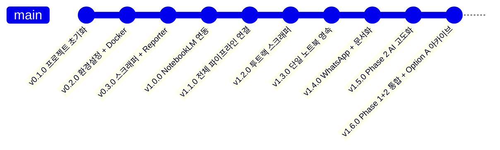
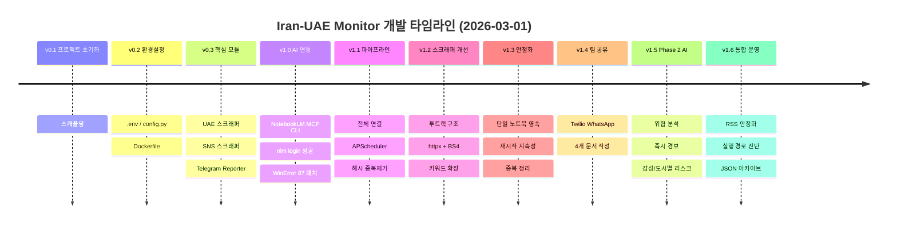
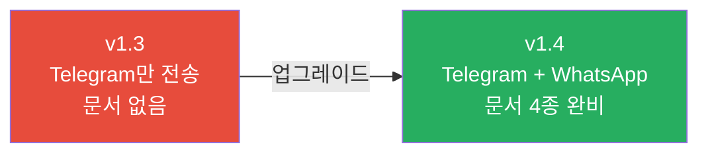
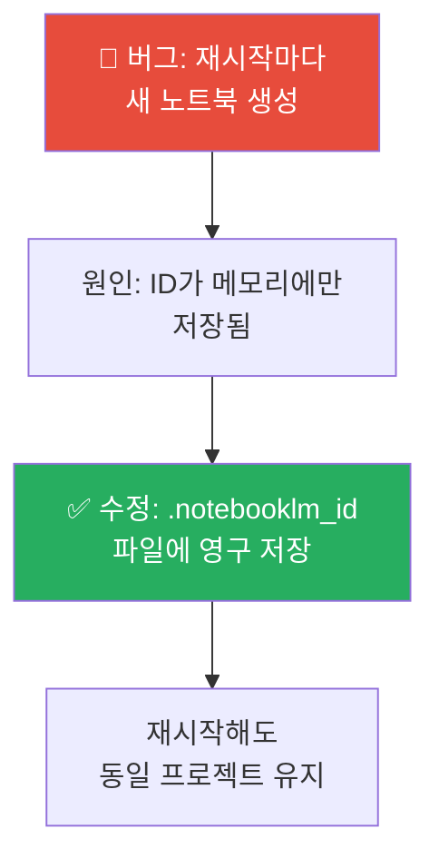
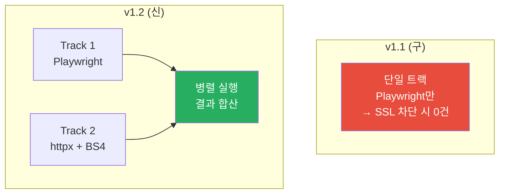
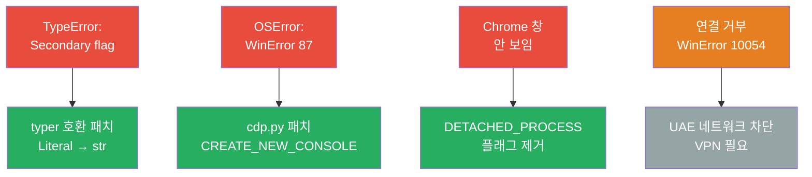
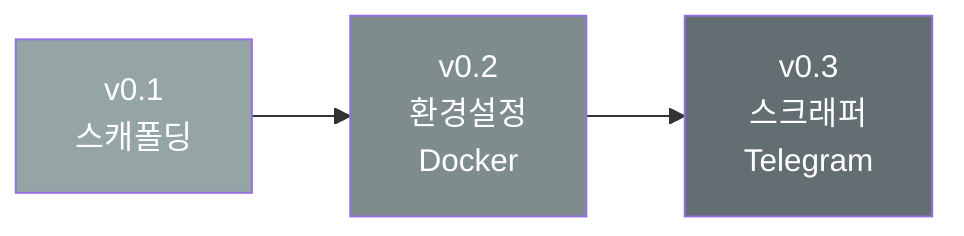

# 📝 CHANGELOG — Iran-UAE Monitor

모든 주요 변경 사항을 이 파일에 기록합니다.  
형식: [Semantic Versioning](https://semver.org/) — 날짜는 UAE 현지 시간 (UTC+4) 기준

---

## 버전 히스토리 개요

---

## 기능 증가 타임라인

---

## [1.6.0] — 2026-03-01

### Phase 1+2 통합 운영 고정

### ✅ Added
- **Option A JSON 아카이브** (`main.py`)
  - `reports/{YYYY-MM-DD}/{HH-MM}.json` 저장
  - 저장 payload: `articles`, `analysis`, `notebook_url`
- **실행 경로 진단 로그**
  - `cwd`, `main_file`, `rss_feed_file`, `canonical_root`를 시작 시 출력
  - 루트 경로 불일치 시 경고 로그 출력
- **RSS 운영 설정 확장** (`config.py`)
  - `RSS_ENABLE_AP_FEED`, `RSS_TIMEOUT_SEC`, `RSS_LOG_VERBOSE_ERRORS`, `RSS_USER_AGENT`

### 🔧 Changed
- 루트 프로젝트를 canonical 실행 대상으로 고정 (`C:\Users\jichu\Downloads\iran-war-notelm-main`)
- RSS 실패 로그를 feed별 경고 스팸 대신 사유 집계 중심으로 정리

### 🧪 Tests
- `test_rss_feed.py`, `test_runtime_paths.py`, `test_report_archive.py` 포함 통합 테스트 구성 유지

---

## [1.5.0] — 2026-03-01

### Phase 2 AI 고도화

- **phase2_ai.py** 신규
  - NotebookLM query 기반 위협 분석 (JSON 파싱)
  - 실패 시 rule-based fallback (키워드 스코어링)
  - 감성 분석: 긴급/일반/회복
  - 도시별 리스크: 아부다비/두바이
  - `should_send_immediate_alert()` 경보 게이팅
- **main.py** 파이프라인 변경
  - upload context dict (notebook_id/source_id/notebook_url) 전달
  - HIGH/CRITICAL 즉시 경보 → 정기 보고 순서
  - `PHASE2_PODCAST_ENABLED` 시 팟캐스트 스캐폴드 호출
- **reporter.py**
  - `send_telegram_alert()` 즉시 경보 전송
  - `_build_report()`에 Phase 2 메타(위협/감성/도시별) 포함
- **config.py** Phase 2 설정 추가
  - PHASE2_ENABLED, PHASE2_QUERY_TIMEOUT_SEC, THREAT_THRESHOLD_*, PHASE2_ALERT_LEVELS, PHASE2_PODCAST_ENABLED, PHASE2_REPORT_LANGUAGE

---

## [1.4.0] — 2026-03-01

### 변경 내용 개요

### ✅ Added
- **Twilio WhatsApp 연동** (`reporter.py`)
  - `_send_whatsapp()`: 팀원 WhatsApp 자동 발송
  - 1500자 초과 시 자동 분할
  - `WHATSAPP_RECIPIENTS` 다수 수신자 지원
- **`config.py`** Twilio 필드 추가
- **문서 4종**: README.md, ARCHITECTURE.md, LAYOUT.md, CHANGELOG.md (Mermaid 다이어그램 포함)

---

## [1.3.0] — 2026-03-01

### 변경 내용 개요

### ✅ Added
- `.notebooklm_id` 파일 기반 노트북 ID 영속화
- `list_notebooks()` 중복 노트북 자동 삭제

### 🐛 Fixed
- 재시작 시 중복 NoebookLM 프로젝트 생성 버그

---

## [1.2.0] — 2026-03-01

### 스크래퍼 개선

### ✅ Added
- **투트랙 스크래퍼** (Playwright + httpx 병렬)
- 키워드 5개 → 25개로 확장
- UAE 섹션 페이지 + 검색 페이지 병행

### 🐛 Fixed
- `article` 셀렉터 → `h2 a, h3 a` 패턴으로 수정 (0건 문제 해결)

---

## [1.1.0] — 2026-03-01

### 파이프라인 연결

### ✅ Added
- 전체 파이프라인 연결 (`main.py` 리라이팅)
- MD5 해시 기반 중복 제거
- APScheduler 매 1시간 자동 실행
- Telegram 봇 설정 완료 (`@newssct_bot`)

### 🐛 Fixed
- `NotebookLMClient` API 메서드명 오류 (`create_source` → `add_text_source`)
- 노트북 객체 구독 오류 (`nb["id"]` → `getattr(nb, "id")`)

---

## [1.0.0] — 2026-03-01

### Windows 패치 히스토리

### ✅ Added
- NotebookLM MCP CLI 설치 및 Google 로그인 완료
- `cdp.py` Windows 호환성 패치
- Antigravity 스킬 파일 생성

---

## [0.1.0 ~ 0.3.0] — 2026-03-01 (초기 구축)

- **v0.1**: 프로젝트 초기화, PLAN.MD 설계 문서
- **v0.2**: `config.py`, `.env`, `requirements.txt`, `Dockerfile`, GitHub Actions
- **v0.3**: UAE 언론 스크래퍼, SNS 스크래퍼, Telegram Reporter, APScheduler
