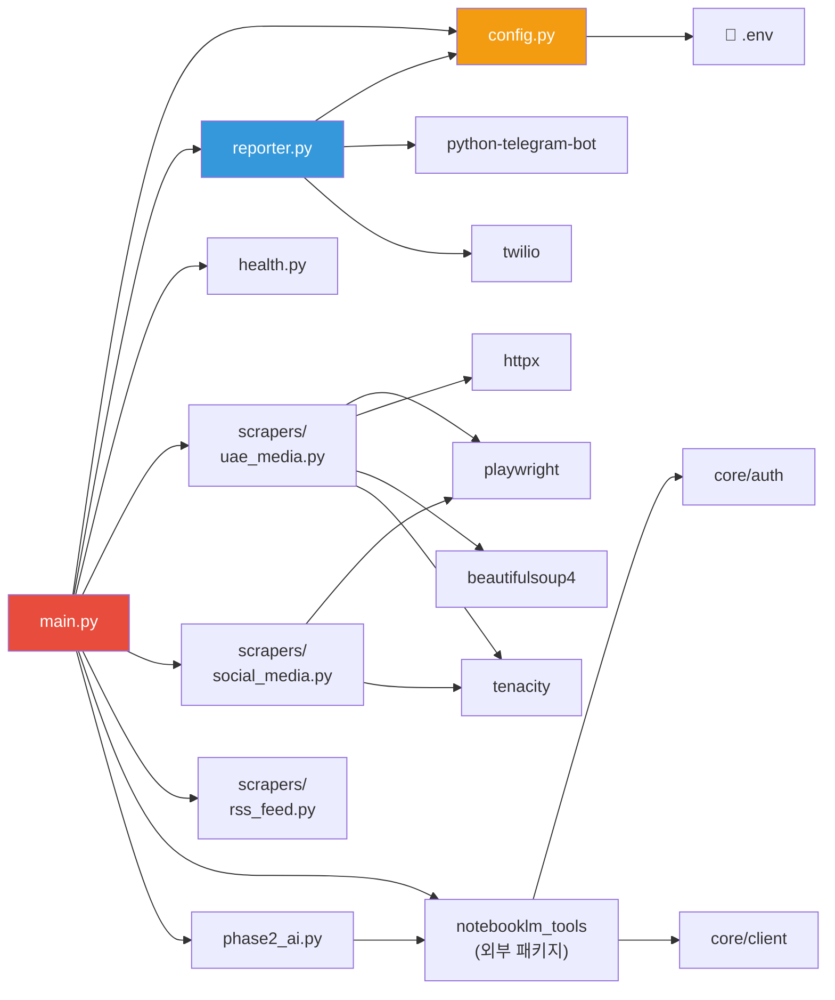
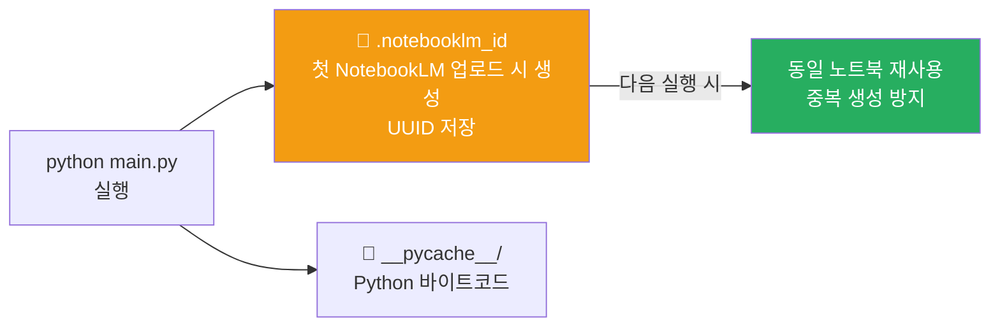

# 📁 Project Layout — Iran-UAE Monitor

## 전체 디렉터리 구조

```mermaid
graph TD
    Root["📁 iran-war-notelm-main/"]

    Root --> Main["📄 main.py\n★ 메인 진입점\nAPScheduler + 전체 파이프라인"]
    Root --> P2AI["📄 phase2_ai.py\nPhase 2 AI 위협 분석 모듈"]
    Root --> Rep["📄 reporter.py\nTelegram + WhatsApp 전송"]
    Root --> Health["📄 health.py\n헬스 상태 API"]
    Root --> Cfg["📄 config.py\n환경변수 Settings"]
    Root --> Scripts["📁 scripts/"]
    Root --> Env["📄 .env\n환경변수 🔒"]
    Root --> NlmId["📄 .notebooklm_id\n노트북 ID 캐시 자동생성"]
    Root --> HealthState["📄 .health_state.json\n최근 헬스 상태"]
    Root --> Reports["📁 reports/\nOption A JSON 아카이브"]
    Root --> Req["📄 requirements.txt"]
    Root --> Docker["📄 Dockerfile"]
    Root --> ReadMe["📄 README.md"]

    Root --> Scrapers["📁 scrapers/"]
    Root --> Docs["📁 docs/"]
    Root --> Tests["📁 tests/"]
    Root --> Agent["📁 .agent/"]
    Root --> Github["📁 .github/"]

    Scrapers --> UAE["📄 uae_media.py\n★ 투트랙 스크래퍼"]
    Scrapers --> Social["📄 social_media.py\nSNS 스크래퍼"]
    Scrapers --> RSS["📄 rss_feed.py\nRSS 피드 집계"]
    Scrapers --> SkillMd["📄 NEWS_SKILL.MD\n설계 원본"]

    Scripts --> RunNow["📄 run_now.py\n즉시 실행 테스트"]
    Scripts --> NlmAuto["📄 notebooklm_auto.py\nNotebookLM 단독 테스트"]
    Scripts --> PathDiag["📄 check_runtime_paths.py\n실행 경로 진단"]

    Docs --> Arch["📄 ARCHITECTURE.md"]
    Docs --> Layout["📄 LAYOUT.md"]
    Docs --> CL["📄 CHANGELOG.md"]

    Agent --> Skills["📁 skills/"]
    Skills --> Skill["📁 real-time-iran-uae-news/"]
    Skill --> SkillFile["📄 SKILL.md"]

    Github --> Workflows["📁 workflows/"]
    Workflows --> Deploy["📄 monitor.yml"]

    style Main fill:#e74c3c,color:#fff
    style UAE fill:#27ae60,color:#fff
    style Rep fill:#3498db,color:#fff
    style Env fill:#e67e22,color:#fff
    style NlmId fill:#95a5a6,color:#fff
```

---

## 파일 의존 관계

---

## `.env` 환경변수 구조

```mermaid
graph TD
    ENV["📄 .env"]

    ENV --> TG["Telegram 설정"]
    ENV --> TW["Twilio WhatsApp"]
    ENV --> P2["Phase 2 설정"]
    ENV --> SYS["시스템 설정"]

    P2 --> P2E["PHASE2_ENABLED"]
    P2 --> P2T["PHASE2_QUERY_TIMEOUT_SEC"]
    P2 --> P2TH["THREAT_THRESHOLD_*"]
    P2 --> P2AL["PHASE2_ALERT_LEVELS"]
    P2 --> P2PC["PHASE2_PODCAST_ENABLED"]
    P2 --> P2RL["PHASE2_REPORT_LANGUAGE"]

    TG --> TGT["TELEGRAM_BOT_TOKEN\n@BotFather 발급"]
    TG --> TGC["TELEGRAM_CHAT_ID\n@userinfobot 확인"]

    TW --> TSID["TWILIO_ACCOUNT_SID\nconsole.twilio.com"]
    TW --> TAT["TWILIO_AUTH_TOKEN"]
    TW --> TFROM["TWILIO_WHATSAPP_FROM\n기본: +14155238886"]
    TW --> TREC["WHATSAPP_RECIPIENTS\n팀원 번호 쉼표 구분"]

    SYS --> HL["HEADLESS\ntrue/false"]
    SYS --> LL["LOG_LEVEL\nINFO/DEBUG"]

    style TG fill:#0088cc,color:#fff
    style TW fill:#25d366,color:#fff
    style P2 fill:#9b59b6,color:#fff
    style SYS fill:#95a5a6,color:#fff
```

---

## 런타임 생성 파일

---

## 환경변수 상세 테이블

| 변수 | 필수 | 기본값 | 설명 |
|---|---|---|---|
| `TELEGRAM_BOT_TOKEN` | ✅ | — | @BotFather에서 발급 |
| `TELEGRAM_CHAT_ID` | ✅ | — | @userinfobot에서 확인 |
| `TWILIO_ACCOUNT_SID` | WhatsApp 시 | — | Twilio Console |
| `TWILIO_AUTH_TOKEN` | WhatsApp 시 | — | Twilio Console |
| `TWILIO_WHATSAPP_FROM` | WhatsApp 시 | `+14155238886` | Sandbox 번호 |
| `WHATSAPP_RECIPIENTS` | WhatsApp 시 | — | 쉼표 구분 국제 번호 |
| `HEADLESS` | ❌ | `true` | Playwright 창 숨김 |
| `LOG_LEVEL` | ❌ | `INFO` | `INFO` / `DEBUG` |
| `RSS_ENABLE_AP_FEED` | ❌ | `true` | AP RSS 포함 여부 |
| `RSS_TIMEOUT_SEC` | ❌ | `15` | RSS 요청 타임아웃(초) |
| `RSS_LOG_VERBOSE_ERRORS` | ❌ | `false` | RSS 상세 예외 로그 출력 여부 |
| `RSS_USER_AGENT` | ❌ | `Iran-UAE-Monitor/1.0` | RSS 요청 User-Agent |
| `PHASE2_ENABLED` | ❌ | `true` | Phase 2 AI 위협 분석 활성화 |
| `PHASE2_QUERY_TIMEOUT_SEC` | ❌ | `90` | NotebookLM query 타임아웃 |
| `THREAT_THRESHOLD_MEDIUM` | ❌ | `40` | 위협 임계값 (MEDIUM) |
| `THREAT_THRESHOLD_HIGH` | ❌ | `70` | 위협 임계값 (HIGH) |
| `THREAT_THRESHOLD_CRITICAL` | ❌ | `85` | 위협 임계값 (CRITICAL) |
| `PHASE2_ALERT_LEVELS` | ❌ | `HIGH,CRITICAL` | 즉시 경보 대상 레벨 |
| `PHASE2_PODCAST_ENABLED` | ❌ | `false` | 팟캐스트 스캐폴드 호출 |
| `PHASE2_REPORT_LANGUAGE` | ❌ | `ko` | Phase 2 보고 언어 |
| `REPORTS_ARCHIVE_ENABLED` | ❌ | `true` | Option A JSON 아카이브 저장 |
| `REPORTS_ARCHIVE_DIR` | ❌ | `reports` | 아카이브 저장 루트 디렉터리 |
