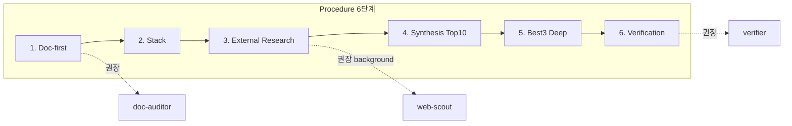
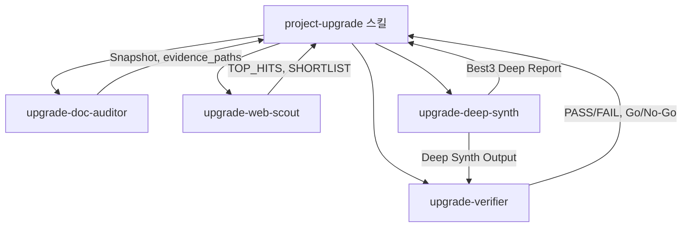
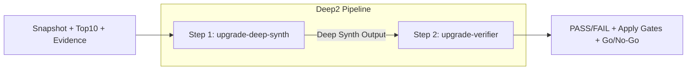
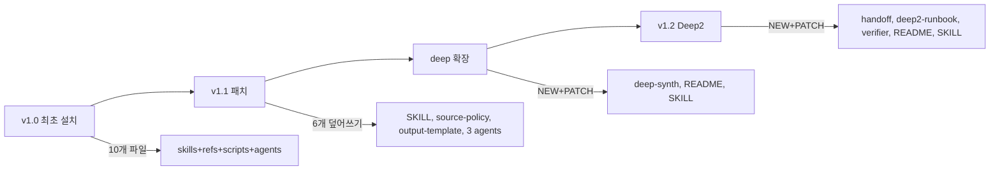

# project-upgrade 스킬 가이드 — 한 문서로 설치·실행·업그레이드·점검

이 문서 하나로 **project-upgrade** 스킬의 설치, 실행, v1.1/deep/deep2 업그레이드, 누락·중복 점검까지 모두 파악할 수 있다.

작성 기준: 2026-03-02

---

## 목차

1. [개요](#section-1)
2. [스킬·서브에이전트 설명과 사용법](#section-2)
3. [최초 설치 (v1.0)](#section-3)
4. [실행 방법](#section-4)
5. [업그레이드 흐름 (v1.1 → deep → v1.2)](#section-5)
6. [산출물 (업그레이드 보고서)](#section-6)
7. [점검 (누락·문서 역할·중복)](#section-7)
8. [참조·파일 트리](#section-8)

---

<a id="section-1"></a>
## 1. 개요

| 항목 | 내용 |
|------|------|
| **목적** | 프로젝트 문서/코드 이해 → 2025-06+ 외부 리서치(EN) → 업그레이드 아이디어·로드맵·Best3 Deep 산출. **자동 코드 변경/커밋/배포 금지.** |
| **설치 위치** | **광역(권장):** `~/.cursor/skills/project-upgrade/`, `~/.cursor/agents/` (Windows: `%USERPROFILE%\.cursor\`). 모든 프로젝트 공통 적용. |
| **프로젝트 전용** | `.cursor/skills/`, `.cursor/agents/` 에 동일 구조 두면 해당 레포에서만 적용(프로젝트가 광역보다 우선). |
| **관련 문서** | 최초 설치: `.cursor/plans/ideaskill.md`. v1.1 패치: `docs/ideaskill.md`. deep 확장: `docs/deepskill.md`. Deep2: `deeppipeskill.md`. |

**실행 모드 선택**

```mermaid
flowchart TD
  Start[/project-upgrade] --> Q{입력/범위}
  Q -->|문서+웹 리서치부터| Full[전체 6단계 파이프라인]
  Q -->|이미 Top10+Evidence 있음| DeepOnly[Deep-only: deep-synth만]
  Q -->|Deep 후 검증까지| Deep2[Deep2: deep-synth → verifier]
  Full --> Out1[UPGRADE_REPORT 전체]
  DeepOnly --> Out2[Best3 Deep Report]
  Deep2 --> Out3[PASS/FAIL + Apply Gates + Go/No-Go]
```

---

<a id="section-2"></a>
## 2. 스킬·서브에이전트 설명과 사용법

### 2.1 project-upgrade 스킬 (메인)

| 항목 | 내용 |
|------|------|
| **용도** | Doc-first + 2025-06+ EN 웹 리서치로 업그레이드 아이디어·로드맵·Best3 Deep 산출. 모든 아이디어에 Evidence(출처/날짜/인기지표) 필수. |
| **When to Use** | "업그레이드 아이디어 + 로드맵 + 근거(출처/날짜)까지", "외부 인기글/공식 docs 기반 베스트프랙티스", "Best 3를 deep report로 상세 설계까지" |
| **Hard Rules** | Evidence 필수 · 원본데이터 날짜 필수(없으면 AMBER_BUCKET) · EN-only 2025-06+ · 공식 docs 우선 · **자동 적용 금지**(코드/커밋/배포 없음, 제안+계획만) |

**Evidence Schema (필수 필드)**  
각 evidence 항목: `platform`(github|medium|geeknews|reddit|official) · `title` · `url` · `published_date`(YYYY-MM-DD, 없으면 AMBER_BUCKET) · `updated_date`(가능하면) · `accessed_date`(실행일) · `popularity_metric`(stars/claps/points/upvotes 등) · `why_relevant`(1~2줄).

**ZERO/AMBER 규칙**  
- **AMBER:** 날짜·인기지표 일부 누락 → AMBER_BUCKET 격리, Top10/Best3 채택 불가.  
- **ZERO:** Best3 후보가 Evidence≥2 조건으로 3개 미만이면 Best3 생성 중단("추가 리서치 필요") 또는 1~2개로 축소 후 사유 명시.

**Procedure (6단계)**  
1. **Doc-first:** README/docs/ADR/SECURITY 등 읽고 현재 상태 스냅샷 + evidence_paths 생성. **아이디어 제안 금지, 진단만.** → 권장: `upgrade-doc-auditor`  
2. **Stack/Constraints:** build/test/CI/의존성·제약 추출  
3. **External Research:** GitHub/Medium/GeekNews/Reddit 10~20개 수집, Evidence Schema 충족. 날짜 불명확 → AMBER_BUCKET. → 권장: `upgrade-web-scout` (background)  
4. **Synthesis:** 6버킷(Reliability, Security, Performance, DX, Architecture, Docs)으로 Top 10 산출. PriorityScore = (Impact×Confidence)/(Effort×Risk). 아이디어당 Evidence ≥1  
5. **Best 3 Deep Report:** Top10 중 상위 3개(Evidence≥2 또는 공식+커뮤니티 권장)에 대해 Deep Dive(Goal, Design, PR Plan≥3, Tests, Rollout/Rollback, Risks, KPIs, Evidence≥2) 작성  
6. **Verification:** Best3·Top10이 스택/제약과 충돌 없는지 PASS/FAIL. 불확실 시 AMBER·Open Questions 최대 3개. → 권장: `upgrade-verifier`  

**Output Contract (최종 출력 9항목)**  
Executive Summary · Current State Snapshot(표) · Upgrade Ideas Top 10(표+Evidence) · **Best 3 Deep Report** · Options A/B/C · 30/60/90 Roadmap · Evidence Table · AMBER_BUCKET · Open Questions(≤3).



---

### 2.2 서브에이전트 4종 (역할·입출력·사용법)

#### upgrade-doc-auditor

| 항목 | 내용 |
|------|------|
| **역할** | 레포 문서만 읽고 **현상(진단)** 만 추출. 아이디어 제안 금지. |
| **입력** | (없음 — 레포 컨텍스트) |
| **출력** | Current State Snapshot(표) · evidence_paths(문서 경로 배열) · pain points · quick wins · open questions(≤3) · JSON(stack, risks, quick_wins, evidence_paths) |
| **사용 시점** | 스킬 Step 1. `/project-upgrade` 실행 시 Agent가 내부적으로 호출하거나, "문서 감사만 먼저 해줘"로 직접 호출. |

---

#### upgrade-web-scout

| 항목 | 내용 |
|------|------|
| **역할** | EN-only 웹 리서치. 2025-06+ 게시물에서 published/updated/accessed + 인기지표 수집. Best3 후보(SHORTLIST) 지원. |
| **필터** | English only · publish ≥ 2025-06-01 · 날짜 없으면 AMBER_BUCKET · GitHub/Medium/GeekNews/Reddit 우선, 공식 docs는 프로젝트 맥락 시만 |
| **출력** | TOP_HITS(10~20, 날짜 충족만) · AMBER_BUCKET · SHORTLIST_FOR_BEST3(최대 6, 인기·적용성·공식+커뮤니티 조합 우선) |
| **사용 시점** | 스킬 Step 3. **background** 실행 권장(동시에 doc-auditor 등 진행 가능). |

---

#### upgrade-deep-synth

| 항목 | 내용 |
|------|------|
| **역할** | **Best 3 전용 Deep Report만** 작성. 문서/웹 리서치 수행 금지. 입력으로 받은 Top10+Evidence+Snapshot으로 Best3 확정 후 Deep Dive만 출력. |
| **입력** | A) Current State Snapshot  B) Top10(점수·버킷 포함)  C) Evidence Table(platform, title, url, published/updated/accessed_date, popularity_metric, why_relevant) |
| **게이트** | Best3: evidence≥2, 각 evidence에 published_date 또는 updated_date 필수. 미충족 시 AMBER 또는 BEST3_INCOMPLETE. |
| **출력** | Best3 Gate Summary(표) · BEST #1~#3 Deep Dive(Goal, Design, PR Plan≥3, Tests, Rollout/Rollback, Risks, KPIs, Evidence≥2) · Implementation Notes · JSON Envelope(best3[], meta) |
| **사용 시점** | **Deep-only:** 이미 Top10+Evidence가 있을 때 "deep report만" 원할 때. Agent에 "upgrade-deep-synth로 deep report만 작성" + 위 3개 블록 붙여넣기. **Deep2:** Step 1로 deep-synth → Step 2로 verifier 호출. |

---

#### upgrade-verifier

| 항목 | 내용 |
|------|------|
| **역할** | 제안의 스택 적합성·리스크·적용 게이트 검증. Top10+Evidence 또는 **Deep Synth 출력**을 받아 PASS/AMBER/FAIL 판정 + 적용 게이트(dry-run→change list→explicit approval)·롤백·테스트 매트릭스·Go/No-Go 산출. |
| **입력** | A) Current State Snapshot  B) Top10+Evidence Table **또는** Deep Synth Output(Gate Summary + Deep Dives + JSON Envelope) |
| **Hard Gates** | Evidence 완전성(Top10≥1, Best3≥2+날짜) · Deep Dive 완전성(PR≥3, Tests, Rollout/Rollback, KPIs) · 스택/제약 호환 · 보안(secrets/키/내부URL/PII 출력 금지) |
| **출력** | PASS/FAIL 테이블 · Apply Gates 0~4(dry-run, change list, explicit approval, canary, rollback) · Rollout/Rollback Triggers · Minimal Test Matrix · PR Plan Sanity Check · AMBER/Open Questions(≤3) · **Final Go/No-Go** |
| **사용 시점** | 스킬 Step 6(전체 파이프라인 마지막). 또는 **Deep2** Step 2: deep-synth 결과를 넘겨 "Deep2 Gate Review"로 최종 확정. |

---

### 2.3 references 요약

| 파일 | 용도 |
|------|------|
| **source-policy.md** | 허용 소스(EN, 2025-06+), 날짜/인기지표 필수, Evidence 최소(Top10≥1, Best3≥2), 보안(tokens/키/PII 금지). |
| **output-template.md** | 최종 보고서 9섹션 템플릿(Executive Summary ~ Open Questions). Best3 Deep Dive 포맷 포함. |
| **query-playbook.md** | (v1.1에서 유지) 검색/쿼리 가이드. |
| **handoff-contract.md** | Deep2: deep-synth → verifier 넘길 때 필수 입력·Evidence 규칙·Verifier 출력 계약. |
| **deep2-runbook.md** | Deep2 2단계 복붙용 프롬프트: Step 1(deep-synth 입력 블록), Step 2(verifier에 Deep Synth 출력 붙여넣기). |

**스킬·서브에이전트 관계**



---

<a id="section-3"></a>
## 3. 최초 설치 (v1.0)

- **가이드:** `.cursor/plans/ideaskill.md` (또는 프로젝트 내 동일 내용). `docs/ideaskill.md`는 **v1.1 패치용**이므로 최초 설치와 구분한다.
- **경로:** `~/.cursor/skills/project-upgrade/`, `~/.cursor/agents/`.
- **생성할 파일 10개:**

| 구분 | 파일 |
|------|------|
| skills | SKILL.md, README.md |
| references | source-policy.md, query-playbook.md, output-template.md |
| scripts | list_docs.py, detect_stack.py |
| agents | upgrade-doc-auditor.md, upgrade-web-scout.md, upgrade-verifier.md |

- **scripts 용도:** `list_docs.py` — 문서 목록 수집(Doc-first용). `detect_stack.py` — build/test/CI/의존성 등 스택 추정.
- **설치 시 유의:** 전역 설치 **내용**은 가이드와 동일하게 둔다. **문법만** 수정 가능(예: `detect_stack.py`에서 `pat.startswith(".") is False` → `not pat.startswith(".")`).
- **다음:** Cursor 재시작 후 Agent 채팅에서 `/` 입력 → project-upgrade 노출 확인.

---

<a id="section-4"></a>
## 4. 실행 방법

**Cursor 재시작(스킬 반영)**  
`Ctrl+Shift+P` → "Reload Window" 또는 "Developer: Reload Window" 실행.

**project-upgrade 노출 확인**  
Agent 채팅에서 `/` 입력 → 목록에 `project-upgrade` 있는지 확인.

**실행 예시 (복붙)**  
```
/project-upgrade 목표: 업그레이드 아이디어 + 30/60/90 로드맵. 범위: backend+CI
```

**범위 한정 예**  
- 전체: 위와 같이 목표·범위만 지정.  
- 대시보드만: `/project-upgrade 대시보드 업그레이드`

**Deep-only (Best3 Deep Report만)**  
- Agent 채팅에 "upgrade-deep-synth로 deep report만 작성" 지시 후, **Top10 + Evidence Table + Current Snapshot** 을 함께 붙여넣기.  
- 또는 `/project-upgrade` 실행 시 "Best3 deep report만 필요. 웹리서치/문서 스캔 생략. 입력은 아래 Top10/Evidence로 제한."  
- 상세 복붙 프롬프트: `~/.cursor/skills/project-upgrade/references/deep2-runbook.md` 참고.

**Deep2 (2단계)**  
1) upgrade-deep-synth 로 Deep Report only 생성 → 2) upgrade-verifier 로 "Deep2 Gate Review"(PASS/FAIL + Apply Gates). 복붙 프롬프트는 `references/deep2-runbook.md` 참고.



---

<a id="section-5"></a>
## 5. 업그레이드 흐름 (v1.1 → deep → v1.2)

적용 순서와 각 단계에서 건드리는 파일만 정리한다. 교체본·추가본 내용은 해당 가이드 문서를 따른다.

| 단계 | 문서 | 동작 | 대상 파일 |
|------|------|------|-----------|
| **v1.0** | `.cursor/plans/ideaskill.md` | 최초 설치 | skills 2 + references 3 + scripts 2 + agents 3 (총 10개) |
| **v1.1** | `docs/ideaskill.md` | 패치(덮어쓰기) | SKILL.md, source-policy.md, output-template.md, upgrade-doc-auditor.md, upgrade-web-scout.md, upgrade-verifier.md (6개). query-playbook.md **유지**. |
| **deep** | `docs/deepskill.md` | NEW + PATCH | **NEW** agents/upgrade-deep-synth.md. **PATCH** README(Deep-only 실행), SKILL(Deep-only Mode). |
| **v1.2** | `deeppipeskill.md` | NEW + PATCH | **NEW** references/handoff-contract.md, references/deep2-runbook.md. **PATCH** upgrade-verifier.md, README(Deep2 Pipeline), SKILL(Deep2 Mode). |

**v1.1 변경 요지:** Evidence 필수, Best3 Deep, evidence_paths(doc-auditor), 날짜/인기지표 강제, verifier Best3 검증.  
**deep 변경 요지:** Best3 전용 Deep Report만 출력하는 서브에이전트 추가, Deep-only 호출 방법 안내.  
**v1.2 변경 요지:** deep-synth → verifier Handoff 계약, Deep2 복붙 runbook, verifier가 Deep Synth 출력 수용·Apply Gates 0~4·Go/No-Go 출력.



---

<a id="section-6"></a>
## 6. 산출물 (업그레이드 보고서)

**전체 프로젝트** 실행 시 예시 산출: `docs/UPGRADE_REPORT_project-upgrade.md`

- **Doc Audit 블록:** evidence_paths, pain points, quick wins, open questions, JSON block(stack, risks, quick_wins, evidence_paths). (upgrade-doc-auditor 역할)
- Executive Summary, Current State Snapshot(표), Upgrade Ideas Top 10(표·score), Options A/B/C, 30/60/90-day Roadmap, Evidence List, AMBER/Gaps, Verification(PASS/FAIL 표, 리스크, Rollout gates).

**대시보드만** 실행 시 예시 산출: `docs/UPGRADE_REPORT_dashboard.md`

- 범위: `dashboard/` (Next.js 16, React 19, pg). Current State Snapshot(대시보드만), Top 10 대시보드, 30/60/90, Verification, AMBER/Gaps.

**Non-goals:** 코드 변경/Apply/커밋/배포 없음. 제안만 문서로 정리.

---

<a id="section-7"></a>
## 7. 점검 (누락·문서 역할·중복)

**설치 누락 점검**  
가이드 "생성 파일 트리"와 `~/.cursor/` 하위를 대조. 10개(최초) 또는 그 이상(v1.1·deep·v1.2 적용 후) 파일 존재·내용 일치 여부 확인. 문법만 다른 부분(예: detect_stack.py 한 줄)은 허용.

**문서 4종 역할**

| 문서 | 역할 |
|------|------|
| `plans/ideaskill.md` | 최초 설치(v1.0) — 10개 파일 생성용, 파일별 내용 포함. |
| `docs/ideaskill.md` | v1.1 패치 — 6개 교체본. query-playbook 유지. |
| `docs/deepskill.md` | deep-only 확장 — upgrade-deep-synth NEW + README/SKILL 패치. |
| `deeppipeskill.md` | v1.2 Deep2 — handoff·deep2-runbook NEW + verifier/README/SKILL 패치. |

각 문서의 "변경 파일 트리"와 문서 내 교체본/추가본이 일치하면 **누락 없음**.

**스킬잔 중복·겹침**  
Evidence/날짜 규칙, 출력 구조(전체 보고서 vs Deep 전용 vs Verifier 전용), Best3 템플릿, 보안 규칙, Deep-only/Deep2 실행, Apply Gates는 스킬·references·agents에 걸쳐 반복되나 **내용 일치·상충 없음**. 의도된 중복(일관성 유지). 선택 개선: query-playbook에 published_date(YYYY-MM-DD) 명시, Evidence 단일 소스는 source-policy로 정리 가능.

**실행 후 검증 체크리스트**

| 구분 | 확인 항목 |
|------|-----------|
| **일반 실행** | 1) doc-auditor 출력에 evidence_paths 포함, 현상만(아이디어 제안 없음) 2) 최종 보고서에 Evidence Table 포함 3) Top10 각 row에 published/updated_date + accessed_date + popularity_metric 4) Best 3 Deep Report 별도 섹션, Best3 각각 Evidence≥2 5) 날짜 불명확 링크는 AMBER_BUCKET만, Top10/Best3에 미포함 |
| **Deep2** | 1) deep-synth 출력에 JSON Envelope(best3[], meta.version, meta.tz) 포함 2) Best3 각 아이디어 Evidence≥2 + 날짜 포함 3) verifier가 PASS/AMBER/FAIL + Apply Gates 0~4 출력 4) 추정 출처/추정 날짜 0건(없으면 AMBER/FAIL 처리) |

---

<a id="section-8"></a>
## 8. 참조·파일 트리

**프로젝트 내 문서**  
- [docs/ideaskill.md](ideaskill.md) — v1.1 패치  
- [docs/deepskill.md](deepskill.md) — deep-only  
- [deeppipeskill.md](../deeppipeskill.md) — v1.2 Deep2  
- [docs/UPGRADE_REPORT_project-upgrade.md](UPGRADE_REPORT_project-upgrade.md), [docs/UPGRADE_REPORT_dashboard.md](UPGRADE_REPORT_dashboard.md) — 예시 산출물  

**전역 설치 가이드**  
`.cursor/plans/ideaskill.md`

**광역 설치 후 파일 트리 (v1.2 적용 기준)**

```text
~/.cursor/
  skills/project-upgrade/
    SKILL.md
    README.md
    references/
      source-policy.md
      query-playbook.md
      output-template.md
      handoff-contract.md
      deep2-runbook.md
    scripts/
      list_docs.py
      detect_stack.py
  agents/
    upgrade-doc-auditor.md
    upgrade-web-scout.md
    upgrade-verifier.md
    upgrade-deep-synth.md
```
