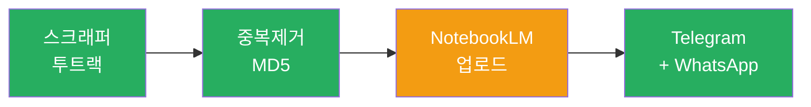
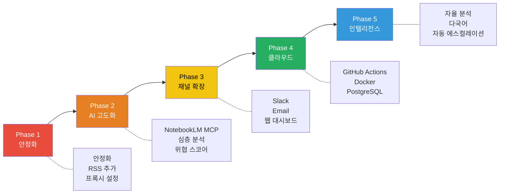
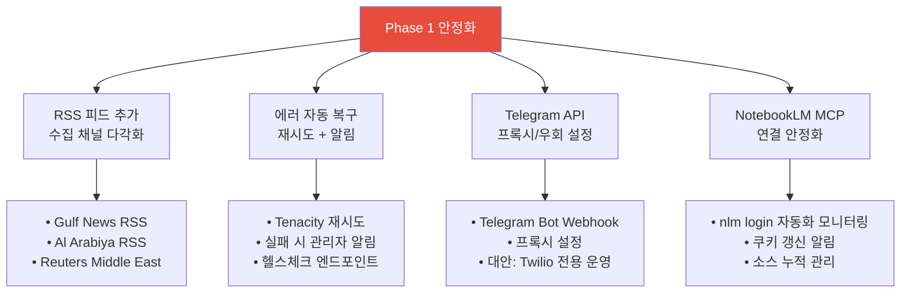
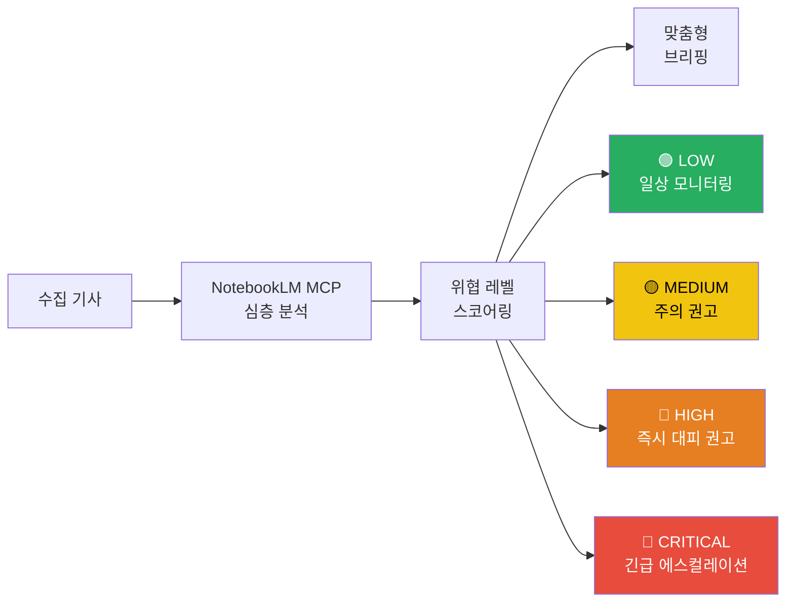
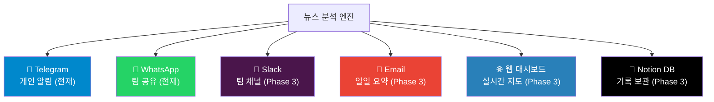
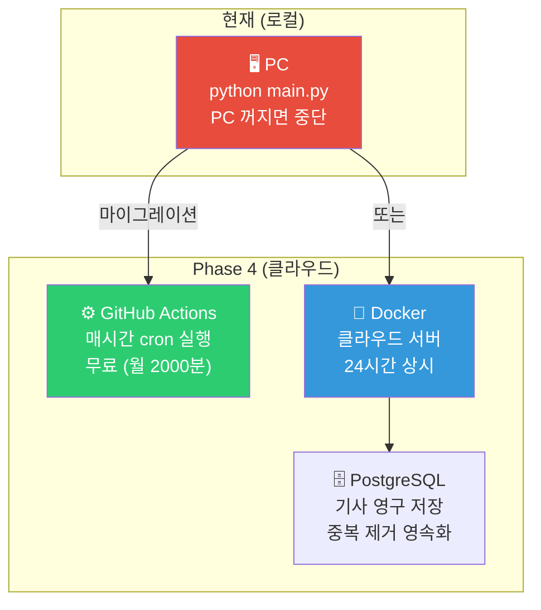
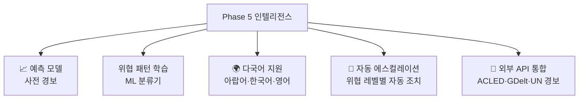
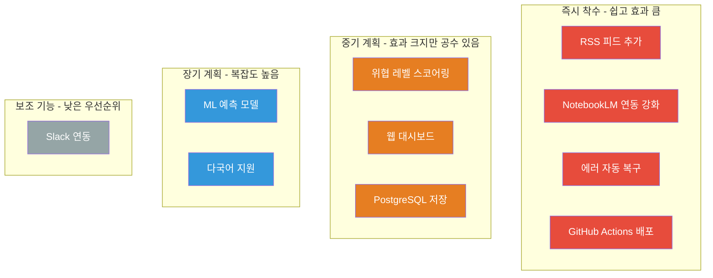
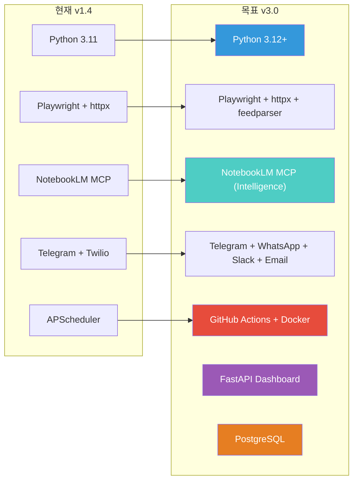

# 🚀 UPGRADE GRAND PLAN — Iran-UAE Monitor

> **현재 v1.4 → 목표 v3.0**  
> 실시간 UAE 안전 모니터링 시스템의 단계별 고도화 로드맵  
> 작성일: 2026-03-01 | 검토 주기: 매월 1회

---

## 현재 시스템 상태 (v1.4 베이스라인)

| 항목 | 현황 |
|---|---|
| 뉴스 소스 | Gulf News, Khaleej Times, The National |
| 스크래핑 방식 | Playwright(JS) + httpx+BS4 투트랙 |
| AI 분석 | NotebookLM 자동 업로드 (VPN 필요) |
| 알림 채널 | Telegram(개인) + WhatsApp Twilio(팀) |
| 실행 주기 | 매 1시간 |
| 배포 | 로컬 Python 프로세스 |

---

## 📋 업그레이드 로드맵

---

## Phase 1 — 안정화 (즉시 착수 가능)

> **목표**: VPN 없이도 100% 자동 실행 가능한 시스템

### 세부 태스크

- [ ] **RSS 피드 통합** (`scrapers/rss_feed.py`)
  - `feedparser` 라이브러리 활용
  - Gulf News, Al Arabiya, Reuters, AP Middle East RSS
- [ ] **NotebookLM MCP 연결 강화**
  - VPN/프록시 환경에서도 `nlm` 명령이 원활하도록 셸 스크립트 래핑
  - 로그인 세션 만료 자동 감지
- [ ] **헬스체크 API** (`health.py`)
  - FastAPI 간단한 `/health` 엔드포인트
  - 마지막 성공 실행 시간, 수집 기사 수 노출
- [ ] **에러 알림** — 파이프라인 실패 시 관리자에게 즉시 Telegram 알림

---

## Phase 2 — AI 고도화

> **목표**: 단순 수집 → 지능형 위협 평가 시스템
> **진행 현황 (2026-03-01)**: Core 3기능(위협 스코어링/감성 분석/도시별 분리 알림) 구현 완료, 팟캐스트는 스캐폴드 단계

### 세부 태스크

- [x] **NotebookLM 기반 위협 스코어링**
  - NotebookLM의 'Custom Instructions'를 활용해 위협 등급 자동 분류
  - 수집된 모든 기사를 하나의 소스로 묶어 전체적인 맥락 분석
  - LOW / MEDIUM / HIGH / CRITICAL 4단계
- [x] **감성 분석** — 뉴스 톤 분석 (긴급/일반/회복 등)
- [x] **아부다비 vs 두바이 위치 분리 알림**
  - 본인 위치에 따라 맞춤 알림 수신
- [ ] **NotebookLM 자동 팟캐스트 생성** (VPN 환경에서)
  - 매일 요약 오디오 브리핑 생성
  - 현재 상태: `PHASE2_PODCAST_ENABLED` 훅 + `create_audio_overview` 호출 스캐폴드만 구현 (전송/배포 미연결)

---

## Phase 3 — 채널 확장

> **목표**: 더 많은 팀원이 더 다양한 채널로 수신

### 세부 태스크

- [ ] **Slack Webhook 연동** (`reporter_slack.py`)
- [ ] **이메일 일일 요약** (`reporter_email.py`) — `smtplib` 또는 SendGrid
- [ ] **실시간 웹 대시보드** (`dashboard/`)
  - FastAPI + Jinja2 또는 Next.js
  - UAE 지도 위에 사건 위치 표시
  - 위협 레벨 색상 표시
- [ ] **Notion 데이터베이스 저장** — 기사 아카이빙 + 트렌드 분석

---

## Phase 4 — 클라우드 24시간 배포

> **목표**: 로컬 PC 종료와 관계없이 24시간 자동 운영

### 세부 태스크

- [ ] **GitHub Actions 크론 배포** (`.github/workflows/monitor.yml`)
  - `schedule: cron: '0 * * * *'` 매 정시 실행
  - GitHub Secrets에 `.env` 값 저장
  - 무료 플랜: 월 2,000분 제공
- [ ] **PostgreSQL 기사 저장** — SQLAlchemy ORM
  - 재시작 후에도 중복 제거 유지 (현재는 메모리에만 저장됨)
- [ ] **Docker Compose** — main + DB + dashboard 통합 실행
- [ ] **클라우드 서버 배포** — Fly.io (무료 티어) 또는 Railway

---

## Phase 5 — 인텔리전스 고도화

> **목표**: 수동 모니터링 → 완전 자율 위기 대응 시스템

### 세부 태스크

- [ ] **에스컬레이션 자동화**
  - CRITICAL 감지 시 → 전체 팀원에게 SMS + WhatsApp + 이메일 동시 발송
  - 대피 루트 자동 첨부 (Google Maps API)
- [ ] **다국어 지원** — 한국어·영어·아랍어 번역 자동화
- [ ] **ACLED / GDelt API 연동** — 학술 분쟁 데이터베이스와 교차 검증
- [ ] **주간 트렌드 리포트** — 7일 데이터 자동 분석 + 시각화

---

## 우선순위 매트릭스

---

## 예상 일정

| Phase | 기간 | 주요 성과 |
|---|---|---|
| **Phase 1** | 즉시 ~ 1주 | VPN 없이 완전 자동 실행, RSS 추가 |
| **Phase 2** | 2~3주 | NotebookLM 위협 스코어링 |
| **Phase 3** | 3~4주 | Slack + 이메일 + 웹 대시보드 |
| **Phase 4** | 1~2개월 | 24시간 클라우드 자동 운영 |
| **Phase 5** | 3~6개월 | 완전 자율 위기 대응 시스템 |

---

## 기술 스택 로드맵

---

> 📌 **다음 즉시 착수 항목**: Phase 1 — RSS 피드 통합 + NotebookLM MCP 연결 안정화  
