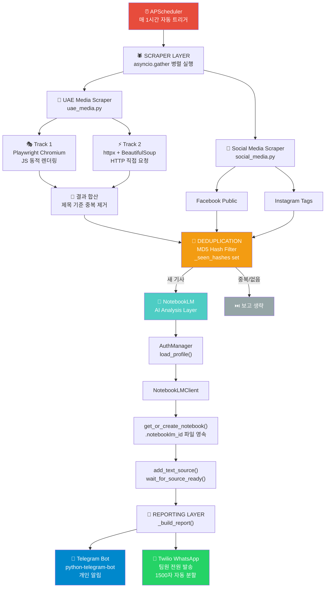
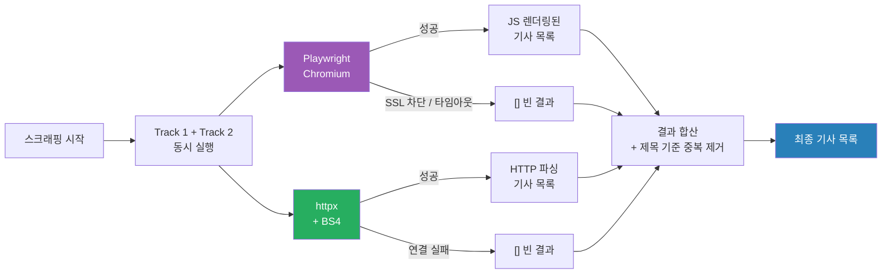
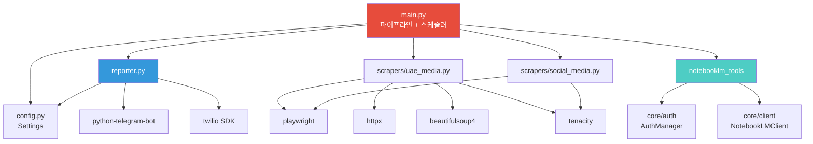
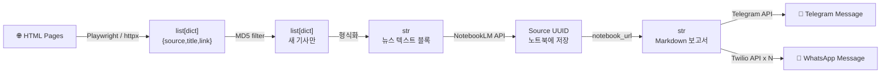
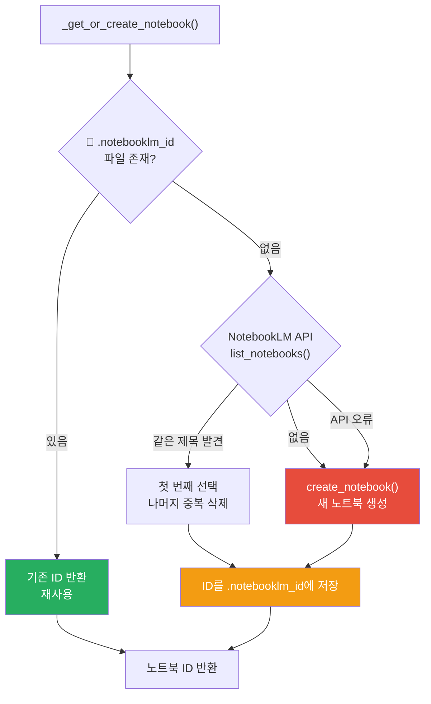
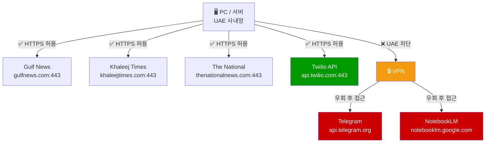

# 🏗️ System Architecture — Iran-UAE Monitor

## 전체 아키텍처 다이어그램

```mermaid
flowchart TD
    SCHED["⏰ APScheduler\n매 1시간 자동 트리거"]

    SCHED --> SCRAPE["🕷️ SCRAPER LAYER\nasyncio.gather 병렬 실행"]

    SCRAPE --> UAE["📰 UAE Media Scraper\nuae_media.py"]
    SCRAPE --> SM["📱 Social Media Scraper\nsocial_media.py"]

    UAE --> T1["🎭 Track 1\nPlaywright Chromium\nJS 동적 렌더링"]
    UAE --> T2["⚡ Track 2\nhttpx + BeautifulSoup\nHTTP 직접 요청"]

    T1 & T2 --> MERGE["🔀 결과 합산\n제목 기준 중복 제거"]

    SM --> FB["Facebook Public"]
    SM --> IG["Instagram Tags"]

    MERGE & FB & IG --> DEDUP["🔁 DEDUPLICATION\nMD5 Hash Filter\n_seen_hashes set"]

    DEDUP -->|새 기사| NLM["🤖 NotebookLM\nAI Analysis Layer"]
    DEDUP -->|중복/없음| SKIP["⏭️ 보고 생략"]

    NLM --> PROF["AuthManager\nload_profile()"]
    PROF --> CLIENT["NotebookLMClient"]
    CLIENT --> NBID["get_or_create_notebook()\n.notebooklm_id 파일 영속"]
    NBID --> SRC["add_text_source()\nwait_for_source_ready()"]

    SRC --> REPORT["📝 REPORTING LAYER\n_build_report()"]

    REPORT --> TG["📡 Telegram Bot\npython-telegram-bot\n개인 알림"]
    REPORT --> WA["💬 Twilio WhatsApp\n팀원 전원 발송\n1500자 자동 분할"]

    style SCHED fill:#e74c3c,color:#fff
    style DEDUP fill:#f39c12,color:#fff
    style NLM fill:#4ecdc4,color:#fff
    style TG fill:#0088cc,color:#fff
    style WA fill:#25d366,color:#fff
    style SKIP fill:#95a5a6,color:#fff
```

---

## 투트랙 스크래퍼 의사결정 흐름

```mermaid
flowchart LR
    START["스크래핑 시작"] --> BOTH["Track 1 + Track 2\n동시 실행"]

    BOTH --> P["Playwright\nChromium"]
    BOTH --> H["httpx\n+ BS4"]

    P -->|"성공"| PR["JS 렌더링된\n기사 목록"]
    P -->|"SSL 차단 / 타임아웃"| PE["[] 빈 결과"]

    H -->|"성공"| HR["HTTP 파싱\n기사 목록"]
    H -->|"연결 실패"| HE["[] 빈 결과"]

    PR & HR & PE & HE --> COMBINE["결과 합산\n+ 제목 기준 중복 제거"]
    COMBINE --> OUT["최종 기사 목록"]

    style P fill:#9b59b6,color:#fff
    style H fill:#27ae60,color:#fff
    style OUT fill:#2980b9,color:#fff
```

---

## 컴포넌트 의존 관계

```mermaid
graph TD
    MAIN["main.py\n파이프라인 + 스케줄러"]

    MAIN --> CONFIG["config.py\nSettings"]
    MAIN --> REP["reporter.py"]
    MAIN --> UAE["scrapers/uae_media.py"]
    MAIN --> SM["scrapers/social_media.py"]
    MAIN --> NLMT["notebooklm_tools"]

    REP --> CONFIG
    REP --> TGSDK["python-telegram-bot"]
    REP --> TWSDK["twilio SDK"]

    UAE --> PW["playwright"]
    UAE --> HX["httpx"]
    UAE --> BS["beautifulsoup4"]
    UAE --> TEN["tenacity"]

    SM --> PW
    SM --> TEN

    NLMT --> AUTH["core/auth\nAuthManager"]
    NLMT --> CLI["core/client\nNotebookLMClient"]

    style MAIN fill:#e74c3c,color:#fff
    style REP fill:#3498db,color:#fff
    style NLMT fill:#4ecdc4,color:#fff
```

---

## 데이터 흐름 (타입 기준)

```mermaid
flowchart LR
    A["🌐 HTML Pages"] -->|"Playwright / httpx"| B["list[dict]\n{source,title,link}"]
    B -->|"MD5 filter"| C["list[dict]\n새 기사만"]
    C -->|"형식화"| D["str\n뉴스 텍스트 블록"]
    D -->|"NotebookLM API"| E["Source UUID\n노트북에 저장"]
    E -->|"notebook_url"| F["str\nMarkdown 보고서"]
    F -->|"Telegram API"| G["📡 Telegram Message"]
    F -->|"Twilio API x N"| H["💬 WhatsApp Message"]
```

---

## NotebookLM 노트북 ID 영속 로직

```mermaid
flowchart TD
    START["_get_or_create_notebook()"]

    START --> FILE{"📄 .notebooklm_id\n파일 존재?"}
    FILE -->|"있음"| USE["기존 ID 반환\n재사용"]
    FILE -->|"없음"| API{"NotebookLM API\nlist_notebooks()"}

    API -->|"같은 제목 발견"| FOUND["첫 번째 선택\n나머지 중복 삭제"]
    API -->|"없음"| CREATE["create_notebook()\n새 노트북 생성"]
    API -->|"API 오류"| CREATE

    FOUND --> SAVE["ID를 .notebooklm_id에 저장"]
    CREATE --> SAVE
    USE --> END["노트북 ID 반환"]
    SAVE --> END

    style USE fill:#27ae60,color:#fff
    style CREATE fill:#e74c3c,color:#fff
    style SAVE fill:#f39c12,color:#fff
```

---

## 네트워크 접근 맵

```mermaid
graph TD
    PC["🖥️ PC / 서버\nUAE 사내망"]

    PC -->|"✅ HTTPS 허용"| GN["Gulf News\ngulfnews.com:443"]
    PC -->|"✅ HTTPS 허용"| KT["Khaleej Times\nkhaleejtimes.com:443"]
    PC -->|"✅ HTTPS 허용"| TN["The National\nthenationalnews.com:443"]
    PC -->|"✅ HTTPS 허용"| TW["Twilio API\napi.twilio.com:443"]
    PC -->|"❌ UAE 차단"| VPN["🔒 VPN"]
    VPN -->|"우회 후 접근"| TG["Telegram\napi.telegram.org"]
    VPN -->|"우회 후 접근"| NLM["NotebookLM\nnotebooklm.google.com"]

    style TG fill:#cc0000,color:#fff
    style NLM fill:#cc0000,color:#fff
    style VPN fill:#f39c12,color:#fff
    style TW fill:#009900,color:#fff
```
