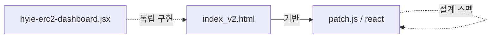
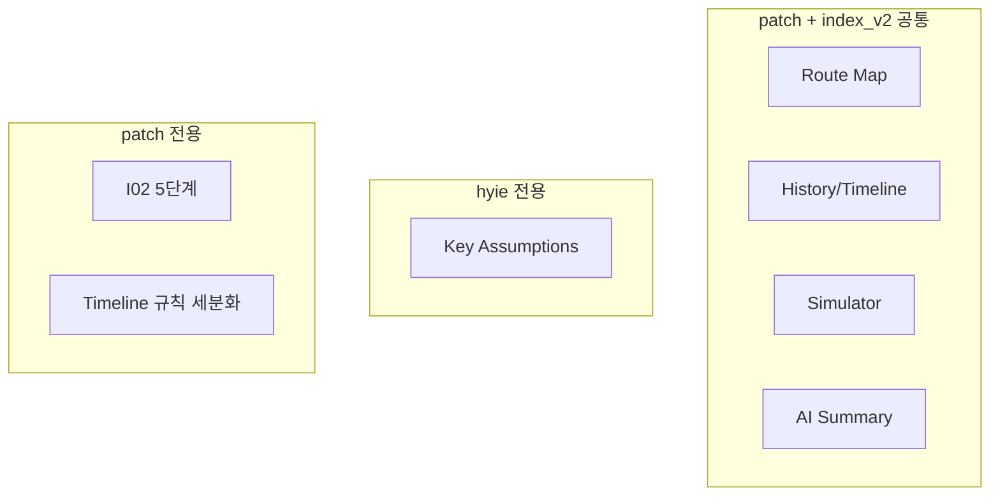

세 파일의 역할과 관계를 요약합니다. 구현 상세는 [컴포넌트구현세부.md](./컴포넌트구현세부.md) 참조.

---

## 1. `urgentdash/docs/patch.js`

**역할**: Leaflet 기반 React 프로젝트용 스캐폴딩/패치 스펙

- **목표**
  - Route Map → Leaflet 실제 지도(lat/lng)
  - Timeline 규칙 세분화 (TIER0 Evidence floor, I02 5단계, Route effective time 급증 등)
  - React + Vite 프로젝트로 구조 분리
- **포함 내용** (상세: [컴포넌트구현세부.md](./컴포넌트구현세부.md))
  - lib, components, App.jsx, fallbackDashboard.js
  - UI 기본 컴포넌트: `Card`, `Pill`, `Bar`, `Gauge`
  - 차트 컴포넌트: `Sparkline`, `MultiLineChart`
  - 기능 컴포넌트: `RouteMapLeaflet`, `TimelinePanel`, `Simulator`
- **deriveState**: `airspaceSegment`(5단계), `evidenceFloorT0`, `evidenceFloorPassed`
- **데이터 소스**: `getDashboardCandidates()` — API, GitHub raw, local JSON (VITE_DASHBOARD_CANDIDATES)
- **route newsRefs**: normalizeRouteItem에 newsRefs 포함 (index_v2와 동일)

---

## 2. `urgentdash/ui/index_v2.html`

**역할**: 단일 HTML 기반 대시보드 (Babel + React 인라인)

- **구조**
  - `deriveState`, `buildDiffEvents`, `appendHistory`, `computeDashboardKey`
  - UI 기본 컴포넌트: `Card`, `Pill`, `Pulse`, `Bar`, `Gauge`
  - `MultiLineChart`, `Sparkline`, `RouteMap`(SVG), `TimelinePanel`, `Simulator`
  - 탭: overview, analysis, intel, indicators, routes, sim, checklist (7개)
- **특징**
  - SVG Route Map (ROUTE_GRAPH)
  - History + Timeline 이벤트
  - AI Situation Summary, Conflict Stats 4카드 그리드(상단)
  - Evidence Floor (indicators 탭, TIER0 cv ≥3)
  - Overview 내 Hypotheses Trend (MultiLineChart), egressLossETA 입력
  - I02는 3단계(OPEN/DISRUPTED/CLOSED)
  - route 카드 `newsRefs`
- **데이터 소스**: DASHBOARD_CANDIDATES (API, GitHub raw, `./data/dashboard.json`) — snapshot JSONL은 hyie 전용
- **buildDiffEvents**: MODE, Gate, airspaceState, evidenceState, leadingHypothesis, ds 임계, route status/cong, intel top (TIER0 floor·I02 5단계·I02 detail·Route eff spike 없음)

---

## 3. `urgentdash/ui/hyie-erc2-dashboard.jsx`

**역할**: React 컴포넌트 형태의 대시보드

- **구조**
  - 하드코딩된 `INTEL_FEED`, `INDICATORS`, `HYPOTHESES`, `ROUTES`, `CHECKLIST`
  - `GaugeArc`, `ProgressBar`, `Card`, `PulsingDot`
  - 탭: overview, intel, indicators, routes, checklist, changelog (6개, analysis 없음, changelog 라벨="Version")
- **특징**
  - API/snapshot JSONL 폴링 (`API_STATE_CANDIDATES`, `snapshotJsonlCandidates`)
  - Alert Banner (Gate, Evidence, Airspace, ΔScore pills)
  - CONFLICT SUMMARY BAR (Missiles, Drones, Cas, Duration, Sources 한 줄)
  - Key Assumptions (A1–A6), VERSIONS(changelog)
  - Evidence Floor Check (indicators 탭, 하드코딩 규칙)
  - bufferFactor 2.0 (effective = base_h × (1+cong) × bufferFactor)
  - EgressLossETA 미입력 시 routes 탭 "Slack 계산 불가" 안내
  - History/Timeline 없음, Simulator 없음, Route Map 없음
  - deriveState 없음 — 필요한 값은 컴포넌트 내부에서 직접 계산

---

## 관계 정리

| 항목                                                     | patch.js                                  | index_v2.html               | hyie-erc2-dashboard.jsx |
| ------------------------------------------------------ | ----------------------------------------- | --------------------------- | ----------------------- |
| Route Map                                              | Leaflet (lat/lng)                         | SVG 스키매틱                    | 없음                      |
| History/Timeline                                       | 있음                                        | 있음                          | 없음                      |
| Simulator                                              | 있음                                        | 있음                          | 없음                      |
| AI Summary                                             | 있음                                        | 있음                          | 없음                      |
| UI 기본 컴포넌트군                                         | Card/Pill/Bar/Gauge                        | Card/Pill/Pulse/Bar/Gauge    | Card/ProgressBar/PulsingDot/GaugeArc |
| Key Assumptions                                        | 없음                                        | 없음                          | 있음                      |
| I02 세분화                                                | 5단계 (NORMAL~CLOSED)                       | 3단계 (OPEN/DISRUPTED/CLOSED) | 3단계                     |
| Evidence Floor                                         | evidenceFloorT0, EVIDENCE_FLOOR_T0_TARGET | indicators 탭 (≥3 PASSED)    | indicators 탭 (하드코딩 규칙)  |
| Conflict Stats                                         | —                                         | 상단 4카드 그리드                  | CONFLICT SUMMARY BAR 한 줄 (Missiles, Drones, Cas, Duration, Sources) |
| Overview Hypotheses Trend                              | analysis 탭에 있음                            | Overview 내 MultiLineChart   | 없음                      |
| Analysis 탭                                             | 있음 (Trends & Log)                         | 있음                          | 없음                      |
| Timeline 규칙 (TIER0/I02 5단계/I02 detail/Route eff spike) | 있음                                        | 없음                          | —                       |
| route newsRefs                                             | 있음 (normalizeRouteItem)                    | 있음 (route 카드)               | 없음                      |

- **patch.js**: index_v2를 기반으로 Leaflet 실제 지도, I02 5단계, 세분화된 Timeline 규칙, React/Vite 구조를 추가·정의한 설계 문서.
- **index_v2.html**: UI 기본 컴포넌트와 기능 컴포넌트를 한 파일에 모두 포함한 단일 HTML 구현.
- **hyie-erc2-dashboard.jsx**: `PulsingDot`을 포함한 UI 위젯 중심 React 구현이며, index_v2/patch와는 기능 구성 범위가 다르다.

---

## React 복구 상태 (운영앱 기준)

`urgentdash/react`에 index_v2 + hyie 핵심 기능 흡수 기준으로 아래 항목을 복구 반영했다.

- `newsRefs` 표시: Routes 카드 하단 관련 레퍼런스 목록 렌더
- Conflict Stats: overview 카드(미사일/드론/사상자/기간·소스) 복구
- Key Assumptions: overview 섹션에 A1~A6 카드 복구
- Version/Changelog: checklist 탭 하단 카드로 통합 복구
- `conflict_stats source`: footer 상태 라인에 표기 복구
- 실시간 갱신: fast poll(기본 30초) + full sync(15분) 이중 폴링 적용
