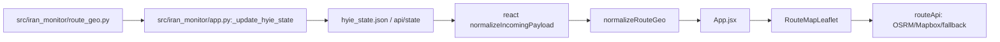
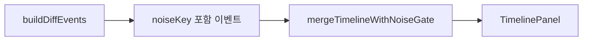

# UrgentDash PATCH2 Layout (독립 문서)

PATCH2(Frontend+Backend) 적용 결과를 기준으로, 실제 코드 구조와 런타임 배치를 한 문서에서 설명한다.
본 문서는 `urgentdash/docs/3파일비교.md`와 달리 비교 목적이 아니라 운영/개발 기준 레이아웃 문서다.

---

## 1. 범위와 기준

- 범위
  - 프론트엔드: `urgentdash/react`
  - 백엔드: `src/iran_monitor`
- 반영 기능
  - 실도로 경로 fetch(OSRM/Mapbox/fallback)
  - I02 detail 규칙 엔진(diff 기반 이벤트)
  - Timeline noise gate(10분 윈도우)
  - `routeGeo`/`route_geo` end-to-end 전달
- 비범위
  - 구형 `index_v2.html`, `hyie-erc2-dashboard.jsx` 레이아웃 상세
  - 문서 비교/이관 정책

---

## 2. 디렉터리 레이아웃

```text
urgentdash/
  react/
    src/
      App.jsx
      components/
        RouteMapLeaflet.jsx
        TimelinePanel.jsx
        Simulator.jsx
        charts.jsx
        ui.jsx
      lib/
        constants.js
        normalize.js
        deriveState.js
        timelineRules.js
        noiseGate.js
        i02DetailRules.js
        routeApi.js
        routeGeoDefault.js
        routeGeo.js   (잔존, 미사용)
      data/
        fallbackDashboard.js
        hyieLegacyContent.js

src/
  iran_monitor/
    app.py
    route_geo.py
    state_engine.py
```

---

## 3. 프론트엔드 화면 레이아웃

### 3.1 페이지 골격 (`App.jsx`)

1. Header
2. Tab Bar (overview, analysis, intel, indicators, routes, sim, checklist)
3. Tab Content
4. Footer status

핵심 상태:
- `dash`: normalize 완료 대시보드
- `history`: 시계열 포인트
- `timeline`: 노이즈 게이트 적용 이벤트
- `selectedRouteId`: Routes 탭 선택 라우트
- `nextEta`: fast poll 기준 다음 갱신 카운트다운
- `liveLagSeconds/liveStale`: stateTs 기준 실시간 지연/신선도

### 3.2 Routes 탭 레이아웃

- 상단: `RouteMapLeaflet`
- 하단: 선택 라우트 정보 + 라우트 카드 목록 + `newsRefs` 목록

`RouteMapLeaflet` 구성:
- 입력: `routes`, `routeGeo`, `selectedId`, `onSelect`
- 지도 레이어: `TileLayer` + `Polyline` + `CircleMarker`
- 경계 맞춤: 노드+라인 합산 `FitBounds`
- 툴팁: `source=osrm|mapbox|fallback`, 오류 메시지(있는 경우)

경로 해석 순서:
1. `routeGeo.routes[routeId].coords`가 있으면 coords 우선
2. 없으면 `waypoints`를 `routeGeo.nodes`로 해석
3. 최소 2개 포인트 미만이면 렌더 스킵

### 3.3 Analysis 탭 레이아웃

- `MultiLineChart`: H0/H1/H2
- `Sparkline`: ΔScore/EvidenceConf
- `TimelinePanel`: noise gate 결과 이벤트 목록

### 3.4 Overview/Checklist 복구 섹션

- overview
  - Conflict Stats 4카드 (Missiles/Drones/Casualties/Duration+source)
  - Key Assumptions(A1~A6) 카드 섹션
- checklist
  - Version/Changelog 카드 섹션 (탭 추가 없이 통합)

---

## 4. 프론트엔드 데이터 레이아웃

### 4.1 normalize 계층 (`normalize.js`)

- `normalizeDashboard()` 반환 스키마:
  - `intelFeed[]`
  - `indicators[]`
  - `hypotheses[]`
  - `routes[]`
  - `checklist[]`
  - `metadata`
  - `routeGeo` (PATCH2 추가)

`normalizeRouteGeo(raw)` 규칙:
- `nodes`
  - `{lat,lng}` 또는 `{latlng:[lat,lng]}` 허용
- `routes`
  - `waypoints[]`, `coords[]`, `provider`, `profile` 정규화
- snapshot 경로(`snapshotToDashboard`)도 `route_geo`/`routeGeo` 모두 수용

### 4.2 Timeline 이벤트 스키마 (`timelineRules.js`)

`mkEvent()` 공통 필드:
- `id`, `ts`, `level`, `category`, `title`, `detail`
- `noiseKey` (PATCH2 추가)

`buildDiffEvents()`에서 생성되는 주요 이벤트:
- MODE/GATE/EVIDENCE 변화
- Evidence floor 변화
- I02 세부 구간 변화
- I02 detail diff
  - 태그 추가/제거
  - 터미널 범위 변화
  - 재개 시각 변화
- ROUTE 상태/혼잡/effective spike
- leading hypothesis 변경
- top intel 교체

### 4.3 Noise gate (`noiseGate.js`)

- 기본 윈도우: `EVENT_NOISE_WINDOW_MS = 10 * 60 * 1000`
- `eventNoiseKey(ev)`: `noiseKey` 우선, 없으면 category/title/detail 기반 생성
- `isSuppressed()`: 같은 키 + 윈도우 내 이벤트 중복 차단
- `mergeTimelineWithNoiseGate()`: 신규 이벤트 병합 후 상한(`TIMELINE_MAX`) 유지

`App.jsx` 적용 지점:
- `logEvent` 단건 로깅
- `applyDashboard`의 diff 이벤트 병합

### 4.4 실시간 이중 폴링

- fast poll
  - 기본 30초(`VITE_FAST_POLL_MS`)
  - 후보: `VITE_FAST_STATE_CANDIDATES` 또는 API 계열 기본 목록
  - 성공 시 즉시 `applyDashboard` 반영
- full sync
  - 15분(`FULL_SYNC_INTERVAL_MS`)
  - `getDashboardCandidates()` 전체 후보 순회
- 실패 노이즈 제어
  - fast poll 연속 실패 임계 도달 시 1건 경고 이벤트
  - 복구 시 1건 recovered 이벤트

---

## 5. 경로 렌더/Fetch 레이아웃

### 5.1 provider/profile 결정

경로별 우선순위:
1. `routeGeo.routes[routeId].provider/profile`
2. 없으면 런타임 기본값
   - `VITE_MAPBOX_TOKEN` 존재 시 provider 기본 `mapbox`
   - 없으면 provider 기본 `osrm`

### 5.2 Fetch 전략 (`routeApi.js`)

- `fetchOsrmRoute()`
  - 기본 base URL: `https://router.project-osrm.org`
  - env override: `VITE_OSRM_BASE_URL`
- `fetchMapboxRoute()`
  - `VITE_MAPBOX_TOKEN` 필수
- `fetchRouteGeometryCached()`
  - waypoint/provider/profile 조합 키로 메모리 캐시
- 실패 처리
  - 지정 provider 실패 + 토큰 존재 시 Mapbox fallback 시도
  - 최종 실패 시 직선 fallback(`provider=fallback`, `profile=straight`)

### 5.3 기본 경로 지오메트리

- `routeGeo` 미존재 payload 대비 `DEFAULT_ROUTE_GEO` 사용
- `routeGeo.js`는 유지하되 현재 경로 렌더 파이프라인에서 참조하지 않음

---

## 6. 백엔드 레이아웃

### 6.1 route_geo 소스 (`route_geo.py`)

- `ROUTE_GEO` 상수 정의
  - `nodes`: 거점 lat/lng
  - `routes`: waypoints/provider/profile
- `build_route_geo_payload()`
  - `deepcopy` 반환으로 런타임 변경 부작용 차단

### 6.2 주입 지점 (`app.py`)

- import: `from .route_geo import build_route_geo_payload`
- 상태 갱신 함수 `_update_hyie_state()`
  - `payload = build_state_payload(...)` 직후
  - `payload["route_geo"] = build_route_geo_payload()`
- 스냅샷 저장 함수 `_persist_hyie_state()`
  - `snapshot_payload`에도 `route_geo` 포함

결과:
- 실시간 API 상태 payload + JSONL snapshot 모두 `route_geo` 일관 제공

---

## 7. End-to-End 데이터 흐름



Timeline 흐름:



---

## 8. 환경 변수 레이아웃

| 변수 | 기본값 | 용도 |
|---|---|---|
| `VITE_OSRM_BASE_URL` | `https://router.project-osrm.org` | OSRM endpoint 변경 |
| `VITE_MAPBOX_TOKEN` | 없음 | Mapbox 라우팅 활성화/OSRM 실패 시 fallback |
| `VITE_FAST_POLL_MS` | `30000` | fast poll 주기(ms) |
| `VITE_FAST_STATE_CANDIDATES` | API 계열 기본 목록 | fast poll 대상 후보 URL |
| `VITE_LEAFLET_TILES_URL` | OSM 기본 타일 | 지도 타일 교체 |
| `VITE_LEAFLET_TILES_ATTRIBUTION` | OSM attribution | 타일 저작권 문구 |

---

## 9. 검증 기준

정적 검증:
1. `cd urgentdash/react && npm run build`
2. `python3 -m compileall -q src/iran_monitor`

동작 검증:
1. 라이브 fetch 1회 후 `hyie_state.json`에 `route_geo` 존재 확인
2. Routes 탭 시각 확인
   - 토큰 없음: OSRM 우선, 실패 시 직선 fallback
   - 토큰 있음: route 설정/실패 조건에 따라 Mapbox 사용 또는 fallback
3. 동일 `noiseKey` 이벤트 10분 내 중복 억제 확인

---

## 10. 운영 메모

- PATCH2 기준으로 경로 렌더는 `routeGeo`가 단일 소스다.
- `cong`/`congestion` 혼용 payload는 normalize 단계에서 계속 호환된다.
- deriveState는 기존 반환(`airspaceSegment`, `airspaceSegmentSeverity`)을 유지하며 추가 수정 없이 PATCH2 요구를 충족한다.
