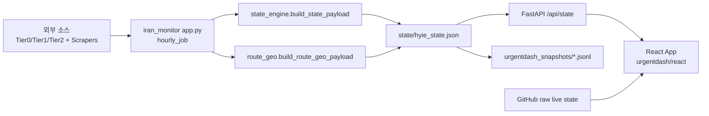
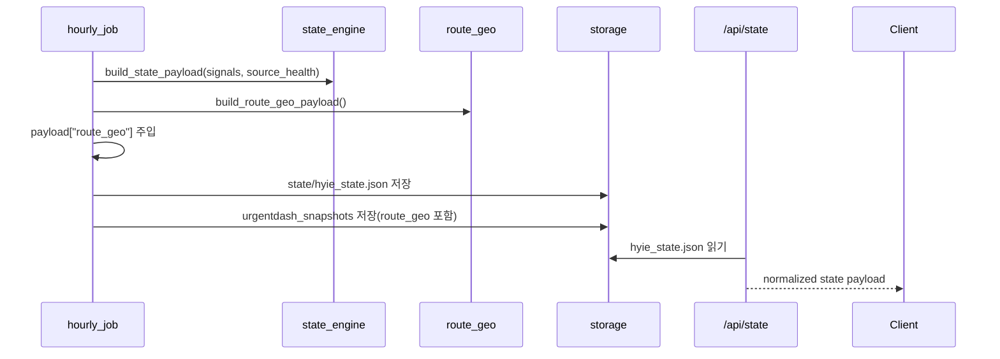
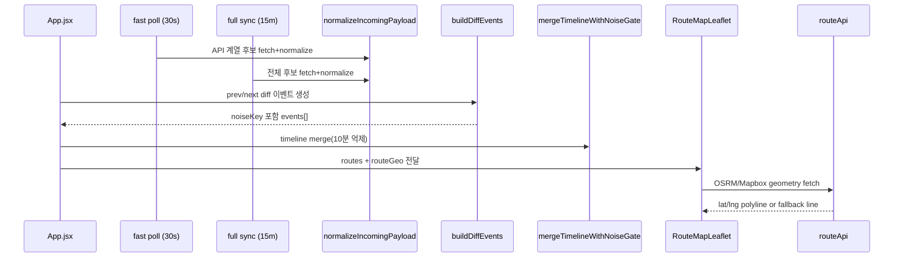

# UrgentDash System Architecture (PATCH2)

본 문서는 PATCH2 적용 완료 기준(2026-03-05)으로 UrgentDash 시스템 아키텍처를 정의한다.
대상은 `urgentdash/react` 프론트엔드와 `src/iran_monitor` 백엔드 상태 파이프라인이다.

---

## 1. 아키텍처 목표

- 30초 fast poll + 15분 full sync로 실시간성과 안정성을 동시에 제공
- API 우선 + 다중 fallback으로 조회 연속성 유지
- Route 지도는 실도로 fetch(OSRM/Mapbox) 우선, 실패 시 직선 fallback
- Timeline은 규칙 기반 이벤트 + noise gate로 신호 대 잡음비 유지
- `route_geo`를 백엔드에서 생성해 프론트까지 end-to-end 전달

---

## 2. 시스템 컨텍스트

외부 의존:
- OSRM public API
- Mapbox Directions API (토큰 설정 시)
- OSM tiles (기본 타일)
- GitHub raw state fallback

---

## 3. 런타임 구성

### 3.1 Backend (`src/iran_monitor`)

핵심 모듈:
- `app.py`: 수집/분석/상태 구성/저장 오케스트레이션
- `state_engine.py`: indicators/hypotheses/routes/checklist 계산
- `route_geo.py`: 정적 지리 노드/경로 정의, payload 생성
- `health.py`: `/health`, `/api/state`, `/api/state/egress-eta` 제공

핵심 포인트:
- `_update_hyie_state()`에서 `build_state_payload()` 후 `payload["route_geo"]` 주입
- `_persist_hyie_state()`에서 snapshot payload에도 `route_geo` 포함
- `/api/state`는 파일 부재 또는 스키마 부족 시 `warming_up_payload()` 반환

### 3.2 Frontend (`urgentdash/react`)

핵심 모듈:
- `App.jsx`: 탭/이중 폴링(30초 fast + 15분 full)/상태 병합/타임라인 로깅
- `lib/normalize.js`: payload 정규화 + `routeGeo` 정규화
- `components/RouteMapLeaflet.jsx`: 지도/경로/노드 렌더
- `lib/routeApi.js`: OSRM/Mapbox fetch + 캐시 + fallback
- `lib/timelineRules.js`: diff 이벤트 생성(`noiseKey` 포함)
- `lib/noiseGate.js`: 10분 중복 억제 병합
- `data/hyieLegacyContent.js`: Key Assumptions/Version 복구 콘텐츠

---

## 4. 데이터 아키텍처

### 4.1 상태 payload 계약

필수(핵심):
- `state_ts`, `status`, `source_health`, `degraded`, `flags`
- `intel_feed`, `indicators`, `hypotheses`, `routes`, `checklist`

선택(PATCH2 확장):
- `route_geo`

`route_geo` 스키마:
- `nodes`: `{ [nodeId]: { label, lat, lng } }`
- `routes`: `{ [routeId]: { waypoints?, coords?, provider?, profile? } }`

프론트 정규화:
- snake_case/camelCase 모두 수용 (`route_geo`, `routeGeo`)
- `nodes`는 `{lat,lng}` 또는 `{latlng:[lat,lng]}` 모두 허용

### 4.2 Timeline 이벤트 계약

표준 이벤트 필드:
- `id`, `ts`, `level`, `category`, `title`, `detail`, `noiseKey`

Noise Gate:
- 윈도우: `EVENT_NOISE_WINDOW_MS = 10m`
- 동일 `noiseKey` + 윈도우 내 이벤트는 suppress

---

## 5. 주요 시퀀스

### 5.1 상태 생성 시퀀스

### 5.2 프론트 렌더 시퀀스

---

## 6. Fallback/복원력 설계

백엔드:
- 상태 파일 미존재/스키마 불완전 시 `warming_up` payload 반환
- 상태 저장은 원본 상태 + snapshot(JSONL/JSON) 동시 기록

프론트:
- Dashboard source 후보 순차 조회(`VITE_DASHBOARD_CANDIDATES`)
- fast poll 후보 순차 조회(`VITE_FAST_STATE_CANDIDATES`)
- `route_geo` 미존재 시 `DEFAULT_ROUTE_GEO` 사용
- Route fetch 실패 시 직선 fallback 렌더 + Tooltip source 표시
- `cong`/`congestion` 혼용 입력 호환
- fast poll 실패는 임계 도달 시에만 이벤트 기록(노이즈 억제)

---

## 7. 배포/실행 토폴로지

Local 표준:
1. `uvicorn src.iran_monitor.health:app --host 127.0.0.1 --port 8000`
2. `cd urgentdash/react && npm run dev -- --host 0.0.0.0 --port 5173`
3. 브라우저 `http://localhost:5173`

정적 배포 보조:
- `update_hyie_state_now.py`로 1회 상태 생성
- `export_hyie_live.py`로 `urgentdash/live` 정적 산출물 생성

---

## 8. 관측성/운영 포인트

- Health endpoint: `/health`
- State endpoint: `/api/state`
- 수동 ETA 관리: `/api/state/egress-eta` GET/POST
- 주요 검증:
  - React `npm run build`
  - Python `python3 -m compileall -q src/iran_monitor`
  - `hyie_state.json`/snapshot의 `route_geo` 존재 확인
  - Routes 탭 OSRM/Mapbox/fallback 시각 확인

---

## 9. 설계 결정 (PATCH2)

- Route 렌더 단일 소스는 `routeGeo`로 통일
- Route provider/profile은 route 정의값 우선, 런타임 env 보조
- Timeline 이벤트는 `noiseKey`를 공개 필드로 관리
- `routeGeo.js`는 즉시 삭제하지 않고 잔존(미참조) 상태 유지

---

## 10. 관련 문서

- `urgentdash/README.md`
- `urgentdash/docs/LAYOUT.md`
- `urgentdash/docs/REQUIREMENTS.md`
- `urgentdash/docs/DEPENDENCIES.md`
- `urgentdash/docs/PATCH2.MD`
