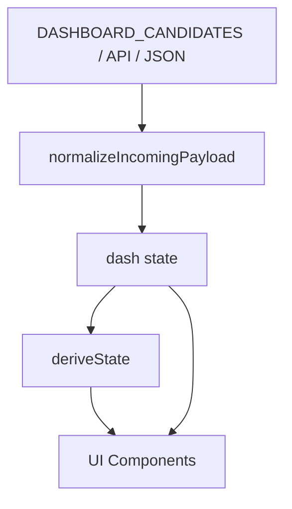
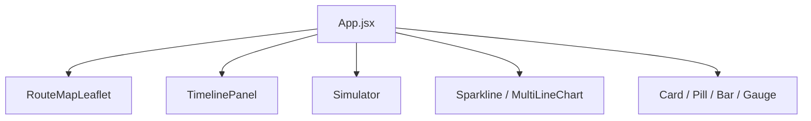
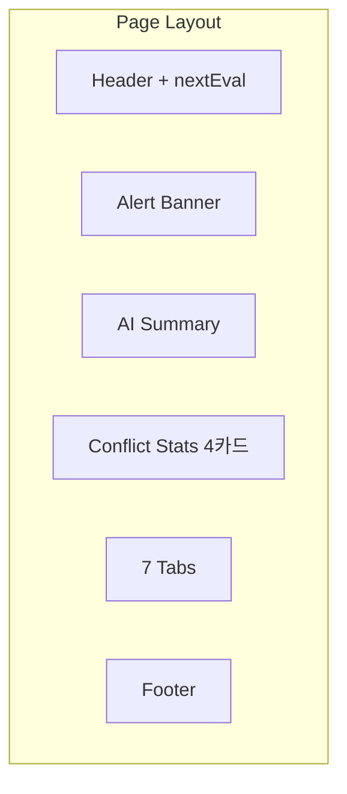

# UrgentDash 세부 컴포넌트 구현 문서

세 파일(patch.js, index_v2.html, hyie-erc2-dashboard.jsx)의 컴포넌트·함수·탭 구성 상세. 기능·역할 비교는 [3파일비교.md](./3파일비교.md) 참조.

---

## 전체 데이터 흐름



- **routeGeo 흐름**: payload.route_geo → normalizeRouteGeo → dash.routeGeo → RouteMapLeaflet

---

## 1. patch.js (스캐폴딩 스펙 + urgentdash/react 구현)

### 1.1 프로젝트 구조 (urgentdash/react/)



```
urgentdash/react/
├── package.json, vite.config.js, index.html
├── src/
│   ├── main.jsx, styles.css, App.jsx
│   ├── data/fallbackDashboard.js
│   ├── data/hyieLegacyContent.js
│   ├── lib/
│   │   ├── constants.js      # 상수
│   │   ├── utils.js          # clamp01, safeNumber, formatTimeGST 등
│   │   ├── normalize.js      # payload 정규화, normalizeRouteGeo
│   │   ├── deriveState.js    # 상태 파생
│   │   ├── timelineRules.js  # buildDiffEvents, appendHistory, mkEvent(noiseKey)
│   │   ├── summary.js        # buildOfflineSummary
│   │   ├── i02DetailRules.js # parseI02Detail, diffI02Detail
│   │   ├── noiseGate.js      # mergeTimelineWithNoiseGate, eventNoiseKey
│   │   ├── routeApi.js       # OSRM/Mapbox fetchRouteGeometryCached
│   │   ├── routeGeoDefault.js# DEFAULT_ROUTE_GEO (fallback)
│   │   └── routeGeo.js       # (레거시, RouteMapLeaflet은 routeGeoDefault 사용)
│   └── components/
│       ├── ui.jsx            # Card, Pill, Bar, Gauge
│       ├── charts.jsx        # Sparkline, MultiLineChart
│       ├── RouteMapLeaflet.jsx
│       ├── TimelinePanel.jsx
│       └── Simulator.jsx
```

### 1.2 UI 컴포넌트 (components/ui.jsx)

| 컴포넌트 | Props | 용도 |
|----------|-------|------|
| Card | `children`, `style` | 카드 래퍼 (배경 #0f172a, border #334155) |
| Pill | `label`, `value`, `color` | 레이블+값 배지 |
| Bar | `value`, `color`, `h` | 수평 진행 바 (0~1) |
| Gauge | `value`, `label`, `sub` | 반원 게이지 (0~1, SVG) |

### 1.3 차트 컴포넌트 (components/charts.jsx)

| 컴포넌트 | Props | 용도 |
|----------|-------|------|
| Sparkline | `data`, `min`, `max`, `color`, `height` | 단일 시계열 미니 차트 |
| MultiLineChart | `series`, `min`, `max`, `height` | 다중 시계열 (H0/H1/H2 등) |

### 1.4 RouteMapLeaflet (components/RouteMapLeaflet.jsx)

| Props | 타입 | 설명 |
|-------|------|------|
| routes | Array | Route 목록 (id, status, name, base_h, cong) |
| routeGeo | object | nodes/routes (waypoints, provider, profile) — payload.route_geo 또는 DEFAULT_ROUTE_GEO |
| selectedId | string | 선택된 route id |
| onSelect | (id) => void | 클릭 시 콜백 |

- 의존: `react-leaflet` (MapContainer, TileLayer, Polyline, CircleMarker, Tooltip, useMap), `leaflet/dist/leaflet.css`
- 데이터: `lib/routeGeoDefault.js` (fallback) + `lib/routeApi.js` (OSRM/Mapbox geometries=geojson fetch)
- OSRM 우선, Mapbox 대체. 실패 시 waypoint straight-line fallback
- FitBounds, Tooltip(provider, effective, error), CircleMarker(노드)

### 1.5 TimelinePanel (components/TimelinePanel.jsx)

| Props | 타입 | 설명 |
|-------|------|------|
| timeline | Array | { id, ts, level, category, title, detail } |
| onClear | () => void | 클리어 버튼 |
| onExport | () => void | 내보내기 버튼 |

- level: ALERT/WARN/INFO/SYSTEM → 색상 매핑

### 1.6 Simulator (components/Simulator.jsx)

| Props | 타입 | 설명 |
|-------|------|------|
| liveDash | object | 현재 대시보드 |
| onLog | (ev) => void | 이벤트 로깅 |

- what-if 편집: hypotheses(H0/H1/H2), indicators(I01~I04), triggers, routes, egressLossETA, evidenceConf, effectiveThreshold, deltaScore
- 편집 후 derived 재계산 → Top routes, Mode, Gate 등 표시

### 1.7 constants (lib/constants.js)

| 상수 | 값/설명 |
|------|---------|
| GST_TIMEZONE | "Asia/Dubai" |
| STORAGE_KEYS | egress, history, timeline, autoSummary |
| HISTORY_MAX_POINTS, TIMELINE_MAX | 96, 220 |
| POLL_INTERVAL_MS, COUNTDOWN_SECONDS | 15*60*1000, 30 |
| FULL_SYNC_INTERVAL_MS | POLL_INTERVAL_MS (15분 full sync) |
| FAST_POLL_MS_DEFAULT, FAST_COUNTDOWN_SECONDS | 30*1000, 30 |
| LIVE_STALE_THRESHOLD_SECONDS | 180 |
| MIN_EVIDENCE_SOURCES, FALLBACK_EGRESS_LOSS_ETA | 2, 2 |
| ROUTE_BUFFER_FACTOR | 2.0 |
| EVIDENCE_FLOOR_T0_TARGET | 3 |
| ROUTE_CONGESTION_DELTA, ROUTE_EFF_SPIKE_RATIO, ROUTE_EFF_SPIKE_HOURS | 0.15, 0.25, 1.5 |
| EVENT_NOISE_WINDOW_MS | 10×60×1000 (noise gate 윈도우) |
| I02_SEGMENTS | NORMAL~CLOSED 5단계 |
| DEFAULT_DASHBOARD_CANDIDATES | API, GitHub raw, local JSON URL 목록 |
| DEFAULT_FAST_STATE_CANDIDATES | API 계열 fast poll URL 목록 |
| getDashboardCandidates | VITE_DASHBOARD_CANDIDATES 또는 기본 목록 반환 |
| getFastStateCandidates | VITE_FAST_STATE_CANDIDATES 또는 기본 목록 반환 |

### 1.8 utils (lib/utils.js)

clamp01, safeNumber, clampEgress, normalizeWhitespace, safeGetLS, safeSetLS, safeJsonParse, toTsIso, splitSources, inferEvidenceFromSource, summarizeSourceHealth, formatTimeGST, formatDateTimeGST, deepClone, downloadJson, tryCopyText, truncate

### 1.9 lib 함수 (패치 스펙)

| 함수 | 파일 | 역할 |
|------|------|------|
| mkEvent | timelineRules.js | 이벤트 객체 생성 (id, ts, level, category, title, detail, noiseKey) |
| getI02Segment | deriveState.js | I02 state → 5단계 (NORMAL~CLOSED) |
| deriveState | deriveState.js | dash → modeState, gateState, airspaceSegment, evidenceFloorT0 등 |
| buildDiffEvents | timelineRules.js | prev/next diff → Timeline 이벤트 (TIER0 floor, I02 5단계, I02 detail, Route eff spike 포함) |
| appendHistory | timelineRules.js | history 배열에 포인트 추가 |
| computeDashboardKey | timelineRules.js | dash → 변경 감지용 키 |
| buildOfflineSummary | summary.js | 룰 기반 상황 요약 텍스트 |
| normalizeDashboard | normalize.js | payload → 정규화 대시보드 |
| normalizeConflictStats, normalizeMetadata | normalize.js | metadata·conflictStats 정규화 |
| normalizeIncomingPayload | normalize.js | incoming → 정규화 대시보드 |
| normalizeRouteGeo | normalize.js | payload.route_geo → { nodes, routes } 정규화 |
| parseI02Detail, diffI02Detail | i02DetailRules.js | I02 detail 태그·터미널·재개시각 파싱·diff |
| eventNoiseKey, mergeTimelineWithNoiseGate | noiseGate.js | Timeline 중복 이벤트 억제 (EVENT_NOISE_WINDOW_MS) |
| fetchRouteGeometryCached, resolveRouteWaypoints | routeApi.js | OSRM/Mapbox 경로 geometry fetch |
| getDashboardCandidates | constants.js | VITE_DASHBOARD_CANDIDATES 또는 기본 목록 |
| getFastStateCandidates | constants.js | VITE_FAST_STATE_CANDIDATES 또는 기본 목록 |

- normalize 내부: normalizeIntelFeedItem, normalizeIndicatorItem, normalizeHypothesisItem, normalizeRouteItem(newsRefs 포함), normalizeChecklistItem, routeGeo

### 1.10 data (fallbackDashboard.js)

- FALLBACK_DASHBOARD: intelFeed, indicators, hypotheses, routes(newsRefs), checklist, metadata
- INITIAL_DASHBOARD: normalizeDashboard(FALLBACK_DASHBOARD) — App 초기 상태

### 1.10-1 data (hyieLegacyContent.js)

- `KEY_ASSUMPTIONS`: overview 복구 카드(A1~A6)
- `VERSION_HISTORY`: checklist 하단 Version/Changelog 카드

### 1.11 Vite 환경 변수

- VITE_DASHBOARD_CANDIDATES: 데이터 소스 URL 목록
- VITE_FAST_POLL_MS: fast poll 주기(ms, 기본 30000)
- VITE_FAST_STATE_CANDIDATES: fast poll용 API 후보 URL 목록
- VITE_LEAFLET_TILES_URL, VITE_LEAFLET_TILES_ATTRIBUTION: Leaflet 타일 (RouteMapLeaflet)
- VITE_OSRM_BASE_URL: OSRM 서버 (기본: router.project-osrm.org)
- VITE_MAPBOX_TOKEN: Mapbox Directions API 토큰 (선택, 없으면 OSRM 사용)

### 1.12 탭 구성

overview, analysis (Trends & Log), intel, indicators, routes, sim, checklist (7개)

### 1.13 React 복구 반영

- 실시간 업데이트: fast poll 30초 + full sync 15분 이중 폴링
- overview: Conflict Stats + Key Assumptions 복구 섹션
- routes: `newsRefs` 표시 복구
- checklist: Version/Changelog 카드 복구

---

## 2. index_v2.html

### 2.0 상수

| 상수 | 값/용도 |
|------|---------|
| STORAGE_KEYS | egress, history, timeline, autoSummary (localStorage) |
| HISTORY_MAX_POINTS, TIMELINE_MAX | 96, 220 |
| FALLBACK_DASHBOARD, INITIAL_DASHBOARD | 초기 대시보드 (INTEL_FEED, INDICATORS, HYPOTHESES, ROUTES, CL_INIT, metadata) |
| SNAPSHOT_REQUIRED_KEYS | snapshot 검증 키 |
| DASHBOARD_CANDIDATES | API, `./api/state`, `api/state`, GitHub raw, `./data/dashboard.json` |
| MIN_EVIDENCE_SOURCES, FALLBACK_EGRESS_LOSS_ETA | 2, 2 |
| CL_INIT | 체크리스트 초기값 |
| bf (bufferFactor) | 2.0 |
| POLL | 15×60×1000 (15분) |
| nextEval | 900초 카운트다운 (1초 간격) |

### 2.1 유틸 함수

| 함수 | 역할 |
|------|------|
| safeGetLS, safeSetLS | localStorage 읽기/쓰기 |
| safeJsonParse | JSON 파싱 (fallback) |
| toTsIso | 타임스탬프 → ISO 문자열 |
| splitSources | 출처 문자열 파싱 |
| inferEvidenceFromSource | 출처 → { verified, sourceCount } |
| summarizeSourceHealth | sourceHealth → { ok, total } |
| normalizeConflictStats | conflictStats 정규화 |
| clampEgress | egressLossETA 클램핑 |
| formatTsGST | ISO → GST 포맷 |
| formatFeedTs | item.tsIso/ts → GST 시간 문자열 (intel/indicator용, formatTsGST와 별도) |
| stat | (value, suffix) => 인라인 헬퍼 |
| copyText | 클립보드 복사 |
| pC (priorityColors) | CRITICAL, HIGH, MEDIUM 색상 매핑 |

### 2.2 normalize 함수

| 함수 | 역할 |
|------|------|
| normalizeIntelFeedItem | intel feed 아이템 정규화 |
| normalizeIndicatorItem | indicator 정규화 (srcCount, cv) |
| normalizeMetadata | metadata 정규화 |
| normalizeHypothesisItem | hypothesis 정규화 (color, name) |
| normalizeDashboard | 전체 payload 정규화 (intelFeed·indicators·hypotheses 정규화, routes·checklist 그대로) |
| hasSnapshotShape | snapshot 형태 검증 |
| snapshotToDashboard | snapshot → 대시보드 |
| normalizeIncomingPayload | incoming → 정규화 대시보드 |

### 2.3 UI 원시 컴포넌트

| 컴포넌트 | Props | 용도 |
|----------|-------|------|
| Card | `children`, `style` | 카드 래퍼 |
| Pill | `label`, `value`, `color`, `bg` | 배지 |
| Pulse | `color` | 깜빡이는 점 (opacity 애니메이션) |
| Bar | `value`, `max`, `color`, `h` | 진행 바 |
| Gauge | `value`, `color`, `label`, `sub` | 반원 게이지 |
| Sparkline | `data`, `height`, `color`, `min`, `max`, `fill`, `showDots` | 단일 시계열 |
| MultiLineChart | `series`, `height`, `min`, `max` | 다중 시계열 |
| RouteMap | `routes`, `selectedId`, `onSelect` | SVG 스키매틱 지도 (ROUTE_GRAPH) |

### 2.4 RouteMap (SVG)

- ROUTE_GRAPH: nodes (x,y), routes (노드 시퀀스)
- polyline + 노드 라벨, status별 색상(OPEN/CAUTION/BLOCKED), 클릭 → onSelect

### 2.5 TimelinePanel

| Props | 설명 |
|-------|------|
| timeline | 이벤트 배열 |
| onClear | 클리어 |
| onExport | JSON 복사 |

- level/cat/q 필터: Level `<select>`, Category `<select>`, Search `<input>`
- filtered 이벤트 목록, JSON Export / Clear 버튼
- 이벤트: level, category, title, detail, ts

### 2.6 buildOfflineSummary

- topIntel 3건, hypotheses, indicators 요약, mode, gate, routes → 룰 기반 텍스트

### 2.7 Simulator

| Props | 설명 |
|-------|------|
| liveDash | 현재 대시보드 |
| liveDerived | deriveState 결과 |
| onLog | 로그 콜백 |

- H0/H1/H2, I01~I04 슬라이더, triggers 토글, routes 편집
- buildDashFromSim → deriveState 재실행 → 미리보기

### 2.8 deriveState

입력: dash, egressLossETAOverride  
출력: i01~i04, hypothesesSorted, leadingHypothesis, ds, ec, effectiveThreshold, triggers, gateStay/Strike/Road, gateState, modeState, evidenceState, airspaceState(3단계), airspaceHint, h2Score, likelihoodLabel/Band/Basis, evidenceFloorT0, escalationItems, deEscalationItems 등

### 2.9 buildDiffEvents

감지: modeState, gateState, airspaceState, evidenceState, leadingHypothesis, ds≥0.20, route status/cong, intel top  
(패치 대비 TIER0 floor, I02 5단계, I02 detail, Route eff spike 없음)

### 2.10 탭 구성

overview, analysis, intel, indicators, routes, sim, checklist (7개) — tabs: { id, l(label), i(icon) }

### 2.11 App 상태·로직

- **mergeChecklist**: 현재 dash.checklist + 새 payload.checklist 병합 (id 기준)
- **applyDashboard**: payload → dash 반영 (normalizeIncomingPayload)
- **fetchDashboard**: DASHBOARD_CANDIDATES 순차 fetch, hasSnapshotShape 검증 후 apply
- **logEvent**: buildDiffEvents → appendHistory, timeline 업데이트
- **storage persist**: egress, history, timeline, autoSummary (STORAGE_KEYS)
- **POLL**: 15분 간격 폴링
- **nextEval**: 900초 카운트다운
- **Auto summary**: buildOfflineSummary → autoSummary state

### 2.12 페이지 레이아웃



- **Header**: 타이틀, nextEval 카운트다운
- **Alert Banner**: Gate, Evidence, Airspace, ΔScore pills
- **AI Summary**: buildOfflineSummary 결과 (autoSummary)
- **Conflict Stats**: 상단 4카드 그리드 (Missiles, Drones, Cas, Duration 등)
- **Footer**: 버전/ICD 문구

### 2.13 기타

- **safeEgressLabel**: egressLossETA 표시용 라벨 (미입력 시 fallback)
- **FALLBACK_DASHBOARD**: intelFeed, indicators, hypotheses, routes, checklist(CL_INIT), metadata
- **External deps**: Babel standalone, React, ReactDOM (UMD CDN)

---

## 3. hyie-erc2-dashboard.jsx

### 3.1 상수 / 하드코딩 데이터

| 이름 | 용도 |
|------|------|
| INTEL_FEED | 인텔 피드 시드 (ts, priority, verified, text, src, srcUrl, impact) |
| INDICATORS | I01~I07 (id, name, tier, state, confirmed/crossVerified, src, ts, detail, srcCount) |
| HYPOTHESES | H0/H1/H2 (id, name, score, desc, color) |
| ROUTES | A/B/C/D (congestion 사용, newsRefs 없음) |
| CHECKLIST | 1~10 항목 |
| VERSIONS | changelog (v, desc, change, active) |
| SNAPSHOT_REQUIRED_KEYS | snapshot 검증 키 |
| SNAPSHOT_POLL_MS | 30_000 |
| API_STATE_CANDIDATES | API URL 후보 |
| bufferFactor | 2.0 (effective 산출) |
| priorityColors, HYPOTHESIS_COLOR | 색상 매핑 |

### 3.2 유틸 함수

| 함수 | 역할 |
|------|------|
| dubaiDatePart | GST 날짜 부분 |
| snapshotJsonlCandidates | JSONL URL 후보 |
| hasSnapshotShape | snapshot 형태 검증 |
| inferIndicatorVerified | indicator verified 추론 |
| normalizeIndicators | indicators 정규화 (applyEvidenceFloor 옵션) |
| normalizeIntel | intel 정규화 (trustVerified 옵션) |
| parseLatestSnapshotFromJsonl | JSONL 파싱 |
| fetchLatestSnapshot | JSONL fetch |
| healthSummary | sourceHealth 요약 문자열 |
| normalizeConflictStats | conflictStats 정규화 (source, updated_at 반환) |
| normalizeHypotheses | hypotheses 정규화 |
| fetchApiState | API state fetch |
| fetchLatestLivePayload | API 또는 JSONL에서 최신 페이로드 |

### 3.3 UI 컴포넌트

| 컴포넌트 | Props | 용도 |
|----------|-------|------|
| PulsingDot | `color` | 깜빡이는 점 |
| ProgressBar | `value`, `max`, `color`, `height` | 진행 바 |
| Card | `title`, `icon`, `children`, `accent`, `fullWidth` | 카드 (타이틀/아이콘 지원) |
| GaugeArc | `value`, `size`, `color`, `label`, `subLabel` | 반원 게이지 (크기 조절 가능) |

- Gauge (index_v2) / GaugeArc (hyie): 구조 유사, GaugeArc는 size, subLabel 옵션

### 3.4 페이지 레이아웃

- **Alert Banner**: Gate, Evidence, Airspace, ΔScore pills
- **CONFLICT SUMMARY BAR**: Missiles, Drones, Cas, Duration, Sources (한 줄)
- **Footer**: "HyIE-ERC² v2026.05 · ICD 203 · 실시간 검증 데이터"

### 3.5 탭별 카드/섹션

| 탭 | 섹션 |
|----|------|
| overview | 상황 시나리오 점수(GaugeArc), ICD 203, Movement Risk Gate, Likelihood, Key Assumptions(A1~A6), Escalation, De-escalation |
| intel | Intel Feed 필터(ALL/CRITICAL/HIGH/MEDIUM), 피드 카드(priority, ts, text, src, impact) |
| indicators | Indicator 카드(ProgressBar, detail, src, crossVerified), Evidence Floor Check(하드코딩 규칙) |
| routes | Route 카드(Base, Congestion 배수, Buffer), effective lead, 하단 "Slack 계산 불가 — EgressLossETA 미입력", "최우선 경로: A..." |
| checklist | SHELTER 모드 준비 체크리스트, 완료 ProgressBar, 토글 |
| changelog (라벨: Version) | VERSIONS |

### 3.6 탭 구성

overview, intel, indicators, routes, checklist, changelog (6개, analysis 없음, changelog 라벨="Version")

### 3.7 상태·로직

- live* state: liveSnapshotTs, liveSource, liveDegraded, liveHealth, liveStatus, liveEvidenceConf, liveUrgency, liveEffectiveThreshold, liveDeltaScore, liveTriggers, liveConflictStats, liveSourceHealth
- applySnapshot: snapshot → state 반영 (normalizeIndicators applyEvidenceFloor, normalizeIntel trustVerified 적용)
- nextEval: 900초 카운트다운
- stat: 인라인 헬퍼 (value, suffix) =>

### 3.8 deriveState

- 별도 함수 없음. Dashboard 컴포넌트 내부에서 gateStay, gateStrike, gateRoad, gateState, airspaceState, leadingHypothesis, deltaScore, likelihoodLabel 등 직접 계산

---

## 4. 컴포넌트 매핑 요약

| 기능 | patch/react | index_v2 | hyie-erc2 |
|------|-------------|----------|-----------|
| Card | ui.Card | Card | Card |
| Pill | ui.Pill | Pill | — |
| Bar | ui.Bar | Bar | — |
| Gauge | ui.Gauge | Gauge | GaugeArc |
| ProgressBar | — | — | ProgressBar |
| Sparkline | charts | Sparkline | — |
| MultiLineChart | charts | MultiLineChart | — |
| Route Map | RouteMapLeaflet | RouteMap(SVG) | 없음 |
| TimelinePanel | TimelinePanel | TimelinePanel | 없음 |
| Simulator | Simulator | Simulator | 없음 |
| Pulse / PulsingDot | — | Pulse | PulsingDot |
| Key Assumptions | 없음 | 없음 | Card 섹션 |
