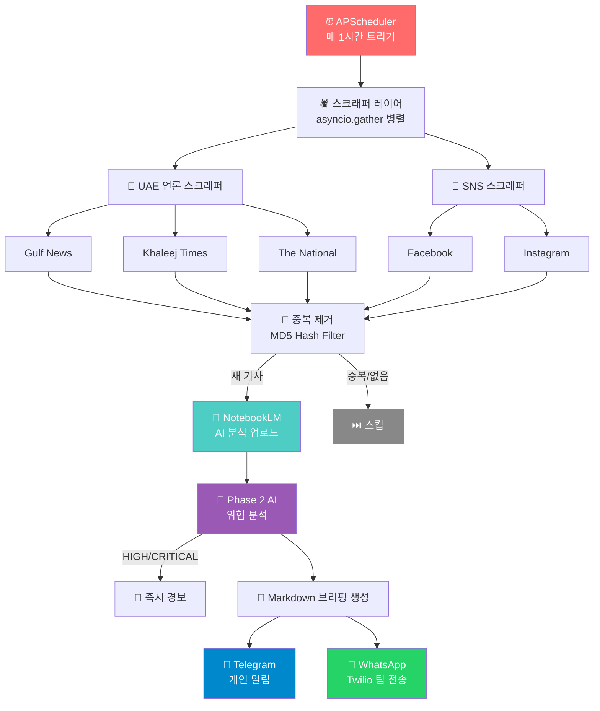
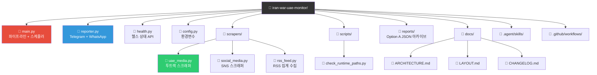
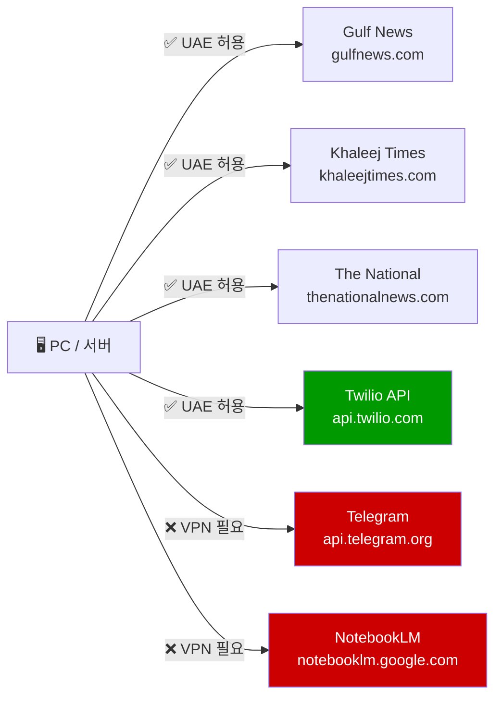

# 🚨 Iran-UAE 실시간 전황 모니터링 시스템

> **실시간 이란-UAE 분쟁 뉴스를 자동 수집 → AI 분석 → WhatsApp/Telegram 브리핑**  
> UAE 거주 교민·출장자·기업 보안팀을 위한 자동화 위기 모니터링 솔루션

---

## ⚠️ Canonical 프로젝트 경로 안내

- 이 루트 프로젝트는 호환 래퍼를 포함한 상위 레이어입니다.
- 실제 운영/개발/테스트 canonical 경로는 아래입니다.

```text
C:\Users\jichu\Downloads\iran-war-notelm-main\iran-war-uae-monitor
```

- 루트 `python main.py` 실행 시 canonical 프로젝트로 자동 위임됩니다.

---

## ✅ v1.6 통합 운영 기준

- Canonical 실행 경로: `C:\Users\jichu\Downloads\iran-war-notelm-main\iran-war-uae-monitor`
- Phase 1 + Phase 2가 루트 프로젝트에 통합됨 (RSS/Health + AI 분석/즉시 경보)
- Option A(JSON 아카이브): `reports/{YYYY-MM-DD}/{HH-MM}.json` 저장
- 중첩 폴더 `iran-war-notelm-main\iran-war-notelm-main`는 실행 대상 아님

---

## 🔄 시스템 전체 흐름



---

## ✨ 주요 기능

| 기능 | 설명 |
|---|---|
| 🕷️ **투트랙 스크래퍼** | Playwright(JS 렌더링) + httpx(HTTP 직접 요청) 병렬 스크래핑 |
| 🔁 **중복 제거** | MD5 해시 기반 기사 중복 필터링 |
| 🤖 **AI 분석** | Google NotebookLM 자동 업로드 + 소스 분석 |
| 🧠 **Phase 2 AI 위협 평가** | NotebookLM query 기반 위협 분석, 실패 시 rule-based fallback |
| 🚨 **HIGH/CRITICAL 즉시 경보** | 위협 레벨에 따른 조건부 즉시 Telegram 경보 |
| 📊 **감성/도시별 리스크** | 긴급·일반·회복 감성, 아부다비/두바이 리스크 분석 |
| 📰 **RSS 수집 안정화** | Gulf News(`/feed`) + Al Bawaba + BBC + AP(옵션) 집계 수집 |
| ❤️ **헬스 상태 추적** | `.health_state.json` 업데이트 + `health.py` 상태 확인 API |
| 💾 **Option A JSON 아카이브** | 매 사이클 기사/분석/NotebookLM URL을 `reports/`에 영구 저장 |
| 📱 **WhatsApp 전송** | Twilio API로 팀원 전원에게 자동 발송 |
| 📡 **Telegram 전송** | 개인 실시간 알림 |
| ⏰ **자동 스케줄** | APScheduler 매 1시간 자동 실행 |
| 🐳 **Docker 지원** | 컨테이너 배포 가능 |

---

## 🚀 빠른 시작

### 1. 설치

```bash
git clone https://github.com/your-org/iran-war-uae-monitor
cd iran-war-uae-monitor
pip install -r requirements.txt
playwright install chromium
```

### 2. 환경 변수 설정

루트 경로에 `.env` 파일이 없다면 생성한 뒤, 아래 값을 채워주세요.

```env
# Telegram (필수)
TELEGRAM_BOT_TOKEN=your_bot_token       # @BotFather에서 발급
TELEGRAM_CHAT_ID=your_chat_id           # @userinfobot에서 확인

# Twilio WhatsApp (팀 공유용)
TWILIO_ACCOUNT_SID=ACxxxxxxxxxxxxxxxx   # console.twilio.com
TWILIO_AUTH_TOKEN=xxxxxxxxxxxxxxxx
TWILIO_WHATSAPP_FROM=+14155238886       # Sandbox 기본 번호
WHATSAPP_RECIPIENTS=+971501234567,+821012345678

# Option A JSON 아카이브
REPORTS_ARCHIVE_ENABLED=true
REPORTS_ARCHIVE_DIR=reports
```

### 3. NotebookLM 로그인 (최초 1회)

```bash
nlm login
```

### 4. 실행

#### 실행 경로 고정 (중요)

```powershell
cd C:\Users\jichu\Downloads\iran-war-notelm-main
python scripts/check_runtime_paths.py
```

`canonical_root`, `main_file`, `rss_feed_file`가 모두 루트 프로젝트를 가리키는지 먼저 확인하세요.

```bash
python main.py        # 매시간 자동 실행
python scripts/run_now.py  # 즉시 1회 실행 (테스트)
python -m pytest -q   # 전체 테스트
```

---

## 📁 프로젝트 구조



---

## 🌐 네트워크 요구사항



---

## 🐳 Docker 배포

```bash
docker build -t iran-uae-monitor .
docker run -d --env-file .env --name iran-uae-monitor iran-uae-monitor
```

---

## 📊 보고 형식 예시

```
🚨 이란 전쟁 UAE 상황 실시간 보고 (2026-03-01 14:00)

⚠️ 위협 레벨: HIGH | 감성: 긴급
📍 아부다비: HIGH | 두바이: MEDIUM

📍 1순위 (아부다비)
• [The National] Zayed International Airport resumes limited operations
• [Gulf News] Abu Dhabi civilian alert level reduced to yellow

📍 2순위 (두바이)
• [Khaleej Times] DXB Departures resume — 47 flights cancelled

🛡️ 안전 메시지: Abu Dhabi / Dubai 체류자는 당국 지시를 따를 것

🔗 출처 링크
• https://thenationalnews.com/...
```

---

## 📄 라이선스

Internal Use Only — UAE 교민 안전 목적 비상업적 사용
